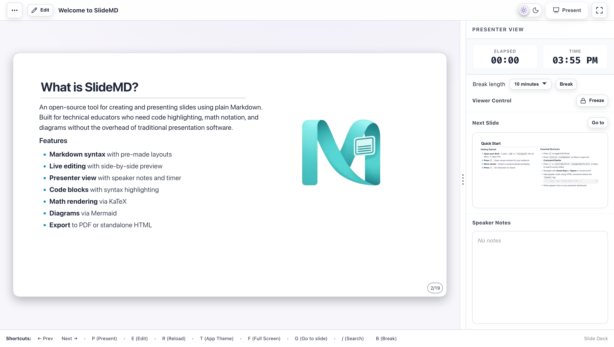
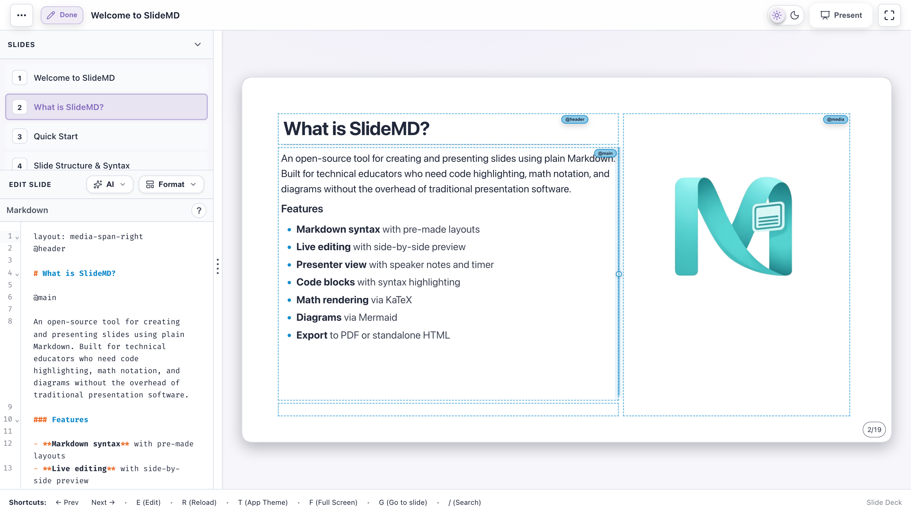

# SlideMD — Markdown Presentations

A lightweight, browser-based slide deck tool for technical educators. Write slides in plain Markdown, present with a dual-window presenter view, and export to PDF or standalone HTML — no account, no cloud, no vendor lock-in.

SlideMD renders on a fixed 16:9 stage (1920x1080) so your deck looks the same on every screen. The editor runs entirely in the browser; the CLI dev server handles file I/O so your `.md` files stay diffable in git.

## Screenshots

**Presenting** — the slide stage with the presenter dashboard (timer, break controls, next-slide preview, and speaker notes):



**Editing** — press `E` for the split-screen editor with slide thumbnails, Markdown source, and a live preview with `@area` guides:



## Features

- **Markdown-first authoring** — layouts, themes, slide/area backgrounds, and media full-bleed via simple directives
- **Live editing** — split-screen editor with instant preview, autocomplete, slash commands, drag-and-drop for images, code, diagrams, and math, plus a drag-to-resize grid for any layout
- **Text blocks** — `::: text-block` container directives for multi-column text, styled blocks, and a speech-bubble preset with tail controls
- **Image styling** — opacity, corner radius, flip, rotation, and brightness/contrast/saturation filters via the image properties panel
- **Dual-window presenter view** — speaker notes, next-slide preview, and break timer
- **Command palette & search** — `Ctrl+K` command palette and full-text slide search (`/` or `Ctrl+Shift+F`)
- **Auto-save & undo** — changes autosave to a local baseline with `Ctrl+S` to disk; global undo/redo spans structural edits, and conflicting edits between windows are detected and resolved
- **Accessibility** — screen-reader announcements of slide changes, semantic slide labels, keyboard-first navigation with documented shortcuts, and alt text preserved from PPTX import through export
- **Code highlighting** via Prism, **math** via KaTeX, **diagrams** via Mermaid
- **Table styling** — `::: table { ... }` container directive for width, alignment, borders, striping, header color, and column weights
- **PPTX import** — convert PowerPoint decks to Markdown with layout inference, in the app or from the command line (`npm run pptx`)
- **AI editing** — enhance, remix, or reimagine slides with OpenRouter, Ollama, or any OpenAI-compatible endpoint; vision-augmented flows can see rendered slides, and Reimagine's proposed outline is editable before generation
- **Export** — standalone HTML (all assets inlined) or deterministic PDF
- **Offline builds** — no Tailwind, no CDN dependencies at runtime
- **`.md + images/` or `.textpack`** — diffable in git or shareable as a single file

## Quick Start

**Requirements:** Node.js `>=22.12` (Node 22 LTS "Jod" or newer). Run `nvm use` to pick it up automatically.

```bash
npm install
npm run dev
```

Opens at http://localhost:8000/index.html. To open a specific deck:

```bash
npm run dev -- path/to/slides.md
```

If the default ports (8000 for Vite, 8001 for the CLI server) are in use,
`npm run dev` automatically finds the next free ports and prints them. To
pin specific ports, set `WEBDECK_VITE_PORT` and `WEBDECK_CLI_PORT`:

```bash
WEBDECK_VITE_PORT=9000 WEBDECK_CLI_PORT=9001 npm run dev
```

Create your first slide:

```markdown
layout: header-content

@header

## Hello, SlideMD

@main

- Press **E** to edit
- Press **P** to present
- Press **F** for fullscreen
```

## Download

Download the latest release from [GitHub Releases](https://github.com/hesamat/slidemd/releases/latest). Each release includes:

- `slides.html` — a single self-contained file that works offline in any browser
- `slides.pdf` — a pre-generated PDF of the example deck

## Documentation

| Topic                                                  | Link                                                     |
| ------------------------------------------------------ | -------------------------------------------------------- |
| Authoring guide (syntax, layouts, text blocks, themes) | [docs/authoring.md](docs/authoring.md)                   |
| AI editing (enhance, remix, reimagine, vision)         | [docs/ai-editing.md](docs/ai-editing.md)                 |
| Import & export (PPTX, .textpack, PDF, HTML)           | [docs/import-export.md](docs/import-export.md)           |
| Keyboard shortcuts                                     | [docs/keyboard-shortcuts.md](docs/keyboard-shortcuts.md) |
| Manual test plan (keyboard & a11y verification)        | [docs/manual-test-plan.md](docs/manual-test-plan.md)     |
| Example deck                                           | [docs/example/slides.md](docs/example/slides.md)         |
| AI prompt structure                                    | [docs/prompt-template.md](docs/prompt-template.md)       |
| AI/tool feature boundary                               | [docs/ai-positioning.md](docs/ai-positioning.md)         |
| How SlideMD compares                                   | [docs/comparison.md](docs/comparison.md)                 |
| Contributing                                           | [CONTRIBUTING.md](CONTRIBUTING.md)                       |
| Roadmap                                                | [ROADMAP.md](ROADMAP.md)                                 |

## Browser Support

SlideMD works in all modern browsers. The CLI dev server and File System Access API features (open/save files from disk) require Chromium-based browsers (Chrome, Edge, Brave). Other browsers (Firefox, Safari) can view decks and use keyboard shortcuts but cannot open or save files directly from the filesystem.

## Privacy & Data

SlideMD is local-first. Nothing you write leaves your machine unless you send it somewhere yourself:

- **Decks stay on your machine.** Markdown and images live on your disk (opened via the File System Access API or the local dev server), with a browser-local baseline for quick-start decks. There is no account, no cloud, and no sync.
- **No telemetry.** The app makes no analytics, tracking, or phone-home calls of any kind.
- **AI is opt-in and direct.** AI features call only the endpoint you configure (OpenRouter, Ollama, LM Studio, or any OpenAI-compatible API), and only when you trigger an AI action. Requests go from your browser straight to that endpoint — slide content is never proxied through us. API keys are stored in your browser's session storage (optionally remembered in local storage) and are never sent anywhere except your chosen endpoint.
- **PPTX font metrics.** Importing a PPTX with diagrams may query Google Fonts to measure font metrics for diagram rendering. Only font family names are sent, never slide content, and the request is non-fatal if it fails.
- **Exports are self-contained.** Exported HTML inlines all assets so decks work offline from a single file; public CDNs appear only as a fallback if local assets cannot be read at export time.

## License

MIT — see [LICENSE](LICENSE) for details.
