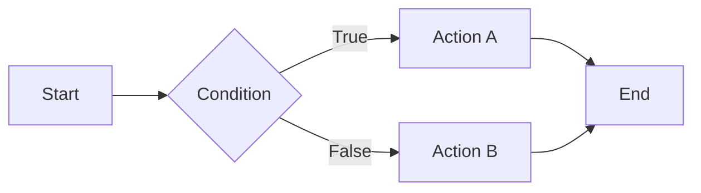
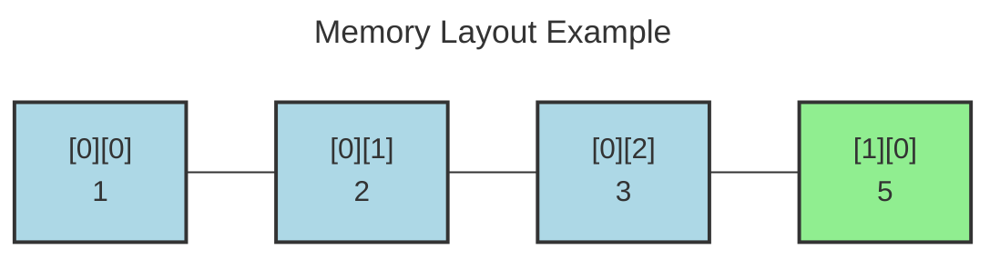

layout: title-slide
background: linear-gradient(135deg, #667eea 0%, #764ba2 100%)

@title

# Authoring Examples and Recipes
## A Complete Guide to Creating Slides

---

layout: header-content

@header
## Introduction

@main
These examples show common patterns when editing slide decks.

**Key Concepts:**
- Slides are separated by `---`
- Any text before the first `@area` marker flows into `@main`
- Layouts control how content is arranged on each slide

**Edit Mode Helpers:**
- Autocomplete for `layout:`, `theme:`, `background:`, `hidden:`, and `@area`
- Slash commands (type `/`) to insert common directives and blocks
- Click area tags in the preview to jump the cursor to that section
- Inline warnings appear on the slide when layout or area markers are mismatched

---

layout: header-two-column

@header
## Layout Presets

@main
The system includes several built-in layout presets:

| Preset | Description |
|--------|-------------|
| `focus` | Single main area, full width |
| `two-column` | Two equal columns |
| `left-heavy` | Two columns, wider left |
| `right-heavy` | Two columns, wider right |
| `header-content` | Header + main + footer |

@media
**Additional presets:**

| Preset | Description |
|--------|-------------|
| `header-two-column` | Header + two columns |
| `title-slide` | Centered title area |
| `three-column` | Three equal columns |
| `sidebar-content` | Fixed sidebar + content |
| `content-sidebar` | Content + fixed sidebar |

---

layout: header-content

@header
## Basic Title Slide

@main
```markdown
layout: title-slide
background: linear-gradient(135deg, #eae4f0 0%, #f9fcfe 100%)

@title

# Loops & Arrays in C
## COMP 5758 – Week 2
### Mo Parsa
```

---

layout: header-content

@header
## Basic Two-Column Slide

@main
Using the `header-two-column` preset:

```markdown
layout: header-two-column

@header
## Where we are in the Course

@main
### Last Week (Week 1)
- C toolchain: **edit → compile → link → run**
- Basic syntax, types, `printf`/`scanf`
- **Decision making:** `if`, `else`, `switch`
- Debugging fundamentals

@media
### Coming Up
- **Week 3:** Functions & Call Stack
- **Week 4:** Pointers
```

---

layout: header-content

@header
## Header + Single Content Area

@main
```markdown
layout: header-content

@header
## By the end of today you can...

@main
- Use **`switch`** statements effectively and avoid fall-through bugs
- Safely write **`while`**, **`for`**, and **`do-while`** loops in C
- Declare, initialize, and iterate over **arrays**
```

---

layout: header-content

@header
## Custom Layouts (CSS Grid)

@main
You can define custom layouts using CSS grid template syntax:

```
layout: "row1" "row2" ... / column-sizes
```

**Key Points:**
- **Rows**: One or more quoted strings; each string is a grid row
- **Columns**: Everything after `/` becomes `grid-template-columns`
- **Row sizing**: Optional size after each row string
- Area names are case-sensitive in CSS

---

layout: header-content

@header
## Custom Layout Examples

@main
**Custom Layout with Row Sizes:**
```markdown
layout: "header" auto "main" 1fr / 800px

@header
## Narrow Content Layout

@main
Content constrained to 800px width, centered.
```

---

layout: header-content
background: linear-gradient(135deg, #667eea 0%, #764ba2 100%)
theme: dark

@header
## Slide Backgrounds

@main
**Code Example:**

```
layout: title-slide
background: linear-gradient(135deg, #667eea 0%,  #764ba2 100%)
theme: dark

@title
# Gradient Background
```

**Supports gradients, images, and solid colors.**

You can use:
- Gradients (like this slide)
- Solid colors: `background: #1a1a1a`
- Images: `background: url(image.jpg)`

---

theme: dark
background: #1a1a2a
layout: header-content

@header
## Dark Theme Example

@main
This slide demonstrates the **dark theme**.

**Code:**
```
theme: dark
background: #1a1a2a
```

Light text automatically appears on dark backgrounds.

---

layout: header-content

@header
## Hidden Slides

@main
Mark a slide as hidden to skip it during normal navigation. Add `?showHidden=1` to the URL to include them when reviewing.

```markdown
layout: header-content
hidden: true

@header
## Instructor Notes Slide

@main
This slide will not appear in the deck by default.
```

---

layout: header-content
<!-- Speaker notes go at the very top of the slide as an HTML comment -->

@header
## Speaker Notes

@main
Add HTML comments at the **very top** of a slide (before layout) for speaker notes:

```
<!-- This is a speaker note visible only in source -->
layout: header-content

@header
## Loop Concepts

@main
Loops allow repeated execution of code blocks.
```

Notes are only visible in presenter mode or source.

---

layout: header-content

@header
## Media Areas

@main
Areas containing images, videos, or iframes are automatically styled with the `.media` class for proper sizing:

```markdown
layout: header-two-column

@header
## Diagram Example

@main
Explanation on the left side.

@media

```

---

layout: header-content

@header
## Markdown Formatting

@main
Use standard markdown for most content - it's cleaner and more maintainable.

**Blockquotes** are perfect for callouts, tips, and important notes:

```markdown
layout: header-content

@header
## Key Concepts

@main
> **Note:** This is a blockquote for highlighting important information.
> Perfect for callouts, tips, and key takeaways.
```

---

layout: header-content

@header
## Blockquote Styling Example

@main
You can add inline styles to blockquotes for emphasis:

```markdown
> **Warning:** Use blockquotes for warnings.
> You can add <span style="color: #dc2626;">colored text</span> or other inline styles as needed.
```

> <span style="color: #dc2626;">**Warning:**</span> Use blockquotes for warnings.
> You can add <span style="color: #dc2626;">colored text</span> or other inline styles as needed.

---

layout: header-content

@header
## HTML Elements and Inline Styling

@main
When you need more control than markdown provides, use HTML elements with inline CSS.

> **Note:** Prefer markdown blockquotes for simple callouts. Use HTML only when you need custom styling.

**Basic example:**
```markdown
<div style="padding: 1rem; background: #f0f0f0; border-radius: 8px;">
  <p style="color: #e74c3c; font-weight: bold;">Styled paragraph</p>
</div>
```

---

layout: header-content

@header
## HTML Styling Examples

@main
**Inline spans with markdown:**
```markdown
Regular text with <span style="color: #e74c3c;">red text</span> 
and <span style="background: #fff3cd; padding: 2px 6px;">highlights</span>.
```

**Flexbox layouts:**
```markdown
<div style="display: flex; gap: 16px;">
  <div style="flex: 1; padding: 20px; background: #667eea; 
    color: white; border-radius: 8px; text-align: center;">
    <h3>Feature A</h3>
  </div>
  <div style="flex: 1; padding: 20px; background: #f093fb; 
    color: white; border-radius: 8px; text-align: center;">
    <h3>Feature B</h3>
  </div>
</div>
```

---

layout: header-content

@header
## Mermaid Diagrams

@main
You can embed Mermaid diagrams using triple-backtick code blocks with the `mermaid` language. 

Mermaid supports various diagram types including:
- Flowcharts
- Sequence diagrams
- State diagrams
- Class diagrams
- Entity relationship diagrams

---

layout: header-two-column

@header
## Basic Mermaid Diagram

@main
**Code Example:**

```
graph LR
    A[Start] --> B{Condition}
    B -->|True| C[Action A]
    B -->|False| D[Action B]
    C --> E[End]
    D --> E
```

Use triple backticks with `mermaid` language.

@media
**Result:**



---

layout: header-two-column

@header
## Mermaid with Title (Recommended)

@main
**Code with Title:**

```
---
title: Memory Layout Example
---
graph LR
    m0["[0][0]<br/>1"]:::row0
    m1["[0][1]<br/>2"]:::row0
    m2["[0][2]<br/>3"]:::row0
    m3["[1][0]<br/>5"]:::row1
    m0 --- m1 --- m2 --- m3
    classDef row0 fill:lightblue
    classDef row1 fill:lightgreen
```

Add `---` section for title at top.

@media
**Result:**



---

layout: header-content

@header
## Common Mermaid Diagram Types

@main
| Type | Description | Example Syntax |
|------|-------------|----------------|
| `graph LR` | Left-to-right flowchart | `A --> B` |
| `graph TD` | Top-down flowchart | `A --> B` |
| `sequenceDiagram` | Sequence diagram | `participant A; A->>B: Message` |
| `stateDiagram-v2` | State diagram | `[*] --> State1` |
| `classDiagram` | Class diagram | `class Animal{+String name}` |
| `erDiagram` | Entity relationship | `Customer \|\|--o{ Order : places...` |

---

layout: header-content

@header
## Mermaid Styling Tips

@main
**Styling:**
- Use `classDef` to define custom styles for nodes
- Use `:::classname` to apply styles to specific nodes
- The `font-size` in Mermaid styles uses `rem` units and will scale with the slide
- Title fonts are automatically adjusted to match slide typography

**Example:**
```markdown
classDef highlight fill:#f9f,stroke:#333,stroke-width:4px
A[Node]:::highlight
```

For complete reference: [mermaid.js.org](https://mermaid.js.org/intro/)

---

layout: header-content

@header
## Tips and Best Practices

@main
**Custom Layouts:**
- Keep every row the same number of cells - ensure each row has the same count of area names or dots
- Use lowercase area names - they are case-sensitive in CSS; `@area` markers are normalized to lowercase

**Content Areas:**
- Named areas without content render as empty regions
- Extra `@area` content without layout placement still renders but won't be positioned as expected

**Row Sizing:**
- Content rows (main/media/left/right/secondary/content/sidebar) default to `minmax(0, 1fr)`
- Header/footer rows default to `auto`
