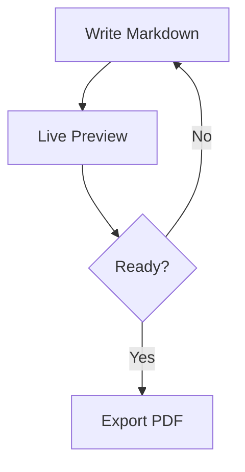

# Authoring Guide

How to write slides in SlideMD. For keyboard shortcuts, see [keyboard-shortcuts.md](keyboard-shortcuts.md). For AI editing, see [ai-editing.md](ai-editing.md). For import/export, see [import-export.md](import-export.md).

## Slide Structure

Slides are separated by `---`. Each slide starts with frontmatter directives, followed by content routed to areas with `@area` markers.

```markdown
layout: header-content

@header

## Slide Title

@main

- Point A
- Point B
```

- The default layout is `header-content`.
- Text before the first `@area` marker flows into `@main`.
- Each `@area` marker must match a name in the layout's grid.
- Hidden slides: set `hidden: true`; add `?showHidden=1` to the URL to include them.

## Directives

Directives go at the top of each slide, before any `@area` markers.

| Directive           | Purpose                       | Example                  |
| ------------------- | ----------------------------- | ------------------------ |
| `layout:`           | Layout preset or custom grid  | `layout: two-column`     |
| `theme:`            | Slide color scheme            | `theme: dark`            |
| `background:`       | Full-slide background         | `background: #1a1a2e`    |
| `area-bg-<name>:`   | Background for one area       | `area-bg-media: #1e293b` |
| `hidden:`           | Skip slide in presentation    | `hidden: true`           |
| `media-full-bleed:` | Media area touches slide edge | `media-full-bleed: true` |

### Backgrounds

Accepts hex colors, gradients, or image URLs:

```yaml
background: #1a1a2e
background: linear-gradient(135deg, #c7d2fe 0%, #f5d0fe 100%)
background: url(https://example.com/hero.png)
```

Combine with `theme: dark` for overlay effects on image backgrounds.

Image backgrounds support sizing, positioning, and repetition in the CSS
shorthand:

```yaml
background: url(images/hero.png) top left / contain repeat-x
background: url(images/hero.png) center / 100% 100% no-repeat # fit
```

The editor's Slide Styles panel (Insert → Slide Styles) exposes Cover /
Contain / Fit / Auto, a 9-point position grid, and Repeat options, and
persists the result into the `background:` value. `fit` maps to `100% 100%`.

### Per-Area Backgrounds

Set a background on a single layout area (e.g. one column) without affecting
the rest of the slide:

```yaml
layout: two-column
background: #0d1117
area-bg-main: #1e293b
area-bg-media: url(images/screenshot.png) center / cover no-repeat
```

`area-bg-<name>:` uses the same value syntax as `background:` (colors,
gradients, or image URLs with size/position/repeat). The `<name>` must match
an area in the layout. Use it sparingly — typically to give one column a
distinct color or image background while the slide background covers the rest.

### Media Full-Bleed

Make the `@media` area span the full slide height edge-to-edge, touching the slide border on its side while content areas keep their padding:

```yaml
layout: two-column
media-full-bleed: true
```

## Layout Presets

| Preset             | Areas                                             | Description                             |
| ------------------ | ------------------------------------------------- | --------------------------------------- |
| `title-slide`      | `@title`                                          | Full-screen centered content            |
| `header-content`   | `@header` `@main` `@footer`                       | Header, content, footer stacked         |
| `focus`            | `@header` `@main` `@footer`                       | Centered content, minimal header/footer |
| `two-column`       | `@header` `@main` `@media` `@footer`              | Two equal columns                       |
| `media-span-right` | `@header` `@main` `@media` `@footer`              | Full-height media on right (1.2:0.8)    |
| `media-span-left`  | `@header` `@main` `@media` `@footer`              | Full-height media on left (0.8:1.2)     |
| `left-heavy`       | `@header` `@main` `@media` `@footer`              | Two columns, left larger (2:1)          |
| `right-heavy`      | `@header` `@main` `@media` `@footer`              | Two columns, right larger (1:2)         |
| `three-column`     | `@header` `@main` `@media` `@secondary` `@footer` | Three equal columns                     |
| `full-image`       | `@main`                                           | Full-bleed image, no text               |

## Custom Layouts

For grids not covered by presets, set a CSS `grid-template` shorthand directly:

```markdown
layout: "header header" "main media" / 2fr 1fr
```

- Quoted rows define area names; column sizes follow the `/` separator.
- Use `.` for empty grid cells.
- Column sizes: `fr`, `px`, `%`, `auto`.
- Add `minmax(0, 1fr)` to content rows to prevent overflow.
- Custom layouts can be saved in the **Layout Picker** (`Custom` tile) as named preferences stored in `localStorage` and reused across decks.

### Examples

**Two equal columns:**

```yaml
layout: "left right" / 1fr 1fr
```

**Fixed width centered:**

```yaml
layout: "header" auto "main" 1fr / 800px
```

## Text Blocks

Use `::: text-block { ... }` to wrap content with custom styling. Attributes are comma- or space-separated.

| Attribute      | Effect             |
| -------------- | ------------------ |
| `column-count` | Multi-column flow  |
| `font-size`    | Override text size |
| `color`        | Text color         |
| `background`   | Background color   |
| `padding`      | Inner padding      |

### Example

```markdown
::: text-block { column-count=2 }

1. First item
2. Second item
3. Third item
4. Fourth item

:::
```

## Markdown Styling

### Text Formatting

- `**Bold**` for **important concepts**
- `*Italic*` for _definitions or emphasis_
- `` `Code` `` for `filenames` and commands
- `[Links](https://example.com)` for references
- `~~Strikethrough~~` for ~~removed content~~

### Tables

| Feature           | Support   |
| ----------------- | --------- |
| Code highlighting | Prism.js  |
| Math rendering    | KaTeX     |
| Diagrams          | Mermaid   |
| Export            | PDF, HTML |

### Blockquotes

Use for key takeaways and callouts:

> **Pro tip:** Combine markdown with inline HTML for custom styling when needed.

## Rendering Features

### Code Highlighting

Fenced code blocks with a language identifier get syntax highlighting via Prism:

```python
def fibonacci(n: int) -> int:
    if n <= 1:
        return n
    return fibonacci(n - 1) + fibonacci(n - 2)
```

Add the `center` keyword inside a curly-brace attribute block after the language to center a code block horizontally in any layout (mirroring the text-block directive syntax):

````markdown
```js { center }
console.log("centered");
```
````

This is useful for short snippets in `header-content` or `two-column` layouts where the default left alignment looks off. The `focus` layout already centers all code blocks by default.

### Math with KaTeX

Inline: `$x = \frac{-b \pm \sqrt{b^2-4ac}}{2a}$` → $x = \frac{-b \pm \sqrt{b^2-4ac}}{2a}$

Block: `$$\int_{-\infty}^{\infty} e^{-x^2} dx = \sqrt{\pi}$$`

For multi-line content with `\begin{aligned}` or similar, the `$$` delimiters must be on their own lines:

```markdown
$$
\begin{aligned}
x &= a + b \\
  &= c + d
\end{aligned}
$$
```

For single-line display math, delimiters can be on the same line:

```markdown
$$E = mc^2$$
```

**Note:** KaTeX has limited LaTeX support. Some advanced packages (`amssymb`, etc.) are not available. Use `\textrm{}` instead of `\text{}` inside math environments like `\begin{cases}` or `\begin{aligned}`.

### Mermaid Diagrams

Use ` ```mermaid ` code blocks:



## Speaker Notes

Place an HTML comment as the **first line** of any slide, before the `layout:` directive:

```markdown
<!-- notes: Your talking points here -->

layout: two-column

@main
Slide content...
```

Notes appear only in the presenter view (press `P`), never on the audience screen or in PDF export.

## Edit Mode Tips

Edit mode (toggled with `E`) uses a CodeMirror-based editor with helpers:

- **Command Palette** — `Ctrl+K` (`Cmd+K` on Mac) to run any action by name.
- **Search** — `/` or `Ctrl+Shift+F` to search across all slides; `Ctrl+F` to search within the current slide.
- **Autocomplete** — `layout:`, `theme:`, `background:`, `hidden:`, and `@area` markers.
- **Slash commands** — type `/` to insert common directives and blocks.
- **Fenced blocks** — type ``` or ~~~ to expand quickly.
- **Click area tags** in the preview to jump the cursor to that section.
- **Overflow indicators** highlight content that doesn't fit an area.
- **Layout picker** shows area tags for each preset.
- **Mermaid helper** inserts common diagram skeletons.
- **Warnings** show on the slide when layout or area markers are mismatched.
- **Image drag reorder** — drag images across columns to reposition them in the markdown.
- **Dashed area outlines** — toggle visibility with the Columns button.
