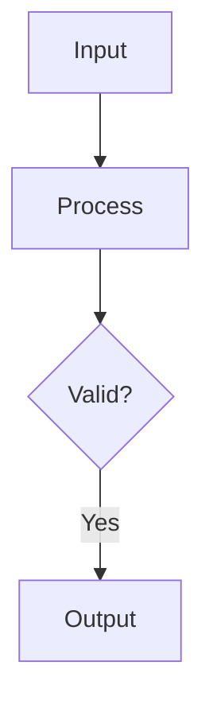
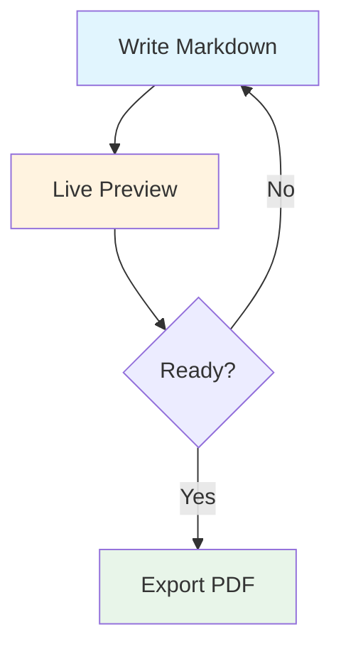

layout: header-two-column

@header

## SlideMD - Markdown-Based Presentations

@main


An open-source tool for creating and presenting slides using plain Markdown. Built for technical educators who need code highlighting, math notation, and diagrams without the overhead of traditional presentation software.

No installation, no accounts, no build steps. Your content stays on your machine.

### Features

- **Markdown syntax** with pre-made layout
- **Live editing** with side-by-side preview
- **Presenter view** with speaker notes, timer, and next slide preview
- **Code blocks** with syntax highlighting (100+ languages)
- **Math rendering** via KaTeX
- **Diagrams** via Mermaid
- **Export** to PDF or standalone HTML

@media


### Getting Started

- **Open File** – Click menu (⋮) → Open File
- **Presenter View** – Press `V` to open a separate window, then move it to your projector or second screen. Press `F` to switch to full-screen view for better readability.
- **Export PDF** – Press `Ctrl+P` to print/export as PDF
- **Export HTML** – Click menu (⋮) → Export HTML

---

layout: header-two-column

<!-- notes: Test speaker notes! -->

@header

## Presentation Flow - Presenter Mode

@main


The default view is your presenter dashboard with:

- **Current Slide** – What the audience sees
- **Presenter Panel**
  - **Next Slide** – Preview of upcoming content
  - **Speaker Notes** – Your private notes (hidden from audience)
  *Tip: Add speaker notes using HTML comments: `<!-- notes: Your private notes here --!>`*
  - **Break controls** – Open break slide with a come back time

### Presenter Shortcuts

| Key | Action |
|-----|--------|
| `V` | Open/close viewer window |
| `F` | Toggle fullscreen |
| `B` | Start break timer |
| `D` | Toggle dark/light theme |

@media

### Typical Presentation Workflow

1. **Open your deck** – Load your `.md` file
2. **Enter presenter mode** – You're already there! The default view shows your slides, notes, and controls
3. **Open viewer window** – Press `V` to open a clean view for your audience
4. **Position windows** – Drag the viewer window to your projector/second screen
5. **Go fullscreen** – Press `F` on the viewer window for a clean presentation
6. **Present** – Use arrow keys or space to navigate
7. **Take breaks** – Press `B` to show a break slide with timer


---

layout: two-column

@main

## Slide Structure & Syntax

### Basic Structure

Slides are separated by `---` and use frontmatter to define layout:

```markdown
layout: header-two-column

@header
## Slide Title

@main
Main content goes here.

@media


---

layout: two-column

@main
# Next slide content
```

### Content Areas

- `@header` – Top section (full width)
- `@main` – Primary content area
- `@media` – Images, diagrams, secondary content
- `@sidebar` – Narrow side column

Different layouts use different combinations of these areas.

@media

### Layout Presets

| Layout | Areas Used |
|--------|------------|
| `focus` | Single centered content |
| `two-column` | Left and right columns (equal) |
| `left-heavy` | Wider left, narrower right |
| `right-heavy` | Wider right, narrower left |
| `header-content` | Header + main area |
| `header-two-column` | Header + two columns |
| `content-sidebar` | Main + narrow sidebar |
| `sidebar-content` | Narrow sidebar + main |
| `three-column` | Three equal columns |
| `title-slide` | Centered title page |

---

layout: left-heavy

@main

## Code, Math & Diagrams

### Code Highlighting

Fenced code blocks with language identifier:

```python
def fibonacci(n: int) -> int:
    if n <= 1:
        return n
    return fibonacci(n - 1) + fibonacci(n - 2)

for i in range(10):
    print(f"F({i}) = {fibonacci(i)}")
```

### Math with KaTeX

Inline: `$x = \frac{-b \pm \sqrt{b^2-4ac}}{2a}$`

Renders as: $x = \frac{-b \pm \sqrt{b^2-4ac}}{2a}$

Block:

$$\int_{-\infty}^{\infty} e^{-x^2} dx = \sqrt{\pi}$$

@media

### Mermaid Diagrams

<div style="height: 450px; overflow-y: hidden;">

````markdown

````

</div>



---

layout: two-column
theme: dark
background: linear-gradient(135deg, #3d53b6 0%, #46216c 100%)
@main

## Custom Layouts

### Grid Syntax

Define custom layouts using CSS Grid syntax:

```markdown
layout: "header header" "main media" / 2fr 1fr
```

**Format:** `"row1" "row2" ... / column-sizes`

### Examples

Two equal columns:
```markdown
layout: "left right" / 1fr 1fr
```

Narrow centered content:
```markdown
layout: "main" / 800px
```

Header and footer:
```markdown
layout: "header" "content" "footer" / 1fr
```

@media

### Slide Options

```markdown
layout: focus
theme: dark            # dark or light
background: #080f42  # custom background color
```

### Tips

Custom layouts give you full control over slide structure.

Use `.` for empty grid cells to create spacing.

Column sizes use CSS units: `fr`, `px`, `%`, etc.

---

layout: header-two-column

@header

## Markdown & Styling

@main

### Blockquotes
Blockquotes make your content more scannable.
Use them for key takeaways, important reminders, and callouts.

> <span style="display: inline-block; padding: 4px 12px; background: rgba(239, 68, 68, 0.12); color: #dc2626; border-radius: 6px; margin-right: 8px;">**Warning:**</span> Add inline `<span>` styles to create highlighted warnings.
> This draws attention without being distracting.

### Text Formatting

Use markdown to emphasize key terms and improve readability:

- **Bold** for important concepts and terminology
- *Italic* for definitions, variables, or subtle emphasis
- `Code` for filenames, commands, and technical terms
- [Links] for references and external resources
- `` for images

@media
### Lists & Formatting

**Unordered lists** (`- item`) – For points without sequence
- Group related concepts
- Keep items parallel in structure

**Ordered lists** (`1. item`) – For steps or priorities
1. Break complex processes into steps
2. Keep action verbs consistent

### Custom HTML

When markdown isn't enough, add inline styles:
```markdown
<span style="color: #e74c3c; font-weight: bold;">
Red text
</span>
<span style="padding: 4px 8px; border-radius: 4px;">
Highlights
</span>
```
---

layout: header-two-column

@header

## Edit Mode

@main

Press `E` to enter edit mode — split-screen with Markdown editor and live preview.

### Key Features

- **Live preview** – See changes instantly as you type
- **Slide thumbnails** – Jump to any slide instantly
- **Quick actions** – Add, delete, duplicate, reorder slides
- **Auto-save tracking** – Know when you have unsaved changes
- **Layout Picker** – Select from preset layouts when adding new slides


@media


---

layout: header-content

@header

## Keyboard Shortcuts

@main

| Key | Action |
|-----|--------|
| `→` / `PgDn` / `Space` | Next slide |
| `←` / `PgUp` / `Backspace` | Previous slide |
| `Home` / `End` | First / Last slide |
| `G` | Go to slide (type number) |
| `F` | Toggle fullscreen |
| `E` | Toggle edit mode |
| `V` | Open Viewer window (for second screen) |
| `D` | Toggle dark/light theme |
| `R` | Reload deck from file |
| `Ctrl+P` | Print/Export PDF |

---

layout: "main" "footer" / 1fr

@main

## Ready to Present!

### Your Next Steps

1. **Open this file** – `docs/example.md` (you're here!)
2. **Press `E`** – Enter edit mode to experiment
3. **Press `V`** – Open viewer window for dual-screen setup
4. **Press `F`** – Go fullscreen and present!

<div style="font-size: 1.4rem; background: #e8f4fd; border-left: 4px solid #2196f3; padding: 16px; margin: 20px 0;">
  <strong>Pro tip:</strong> This presentation is built with SlideMD. Check the source to see how it's made!
</div>

### Learn More

- **`docs/authoring-examples.md`** – Advanced examples & recipes
- **`docs/example.md`** – This presentation's source code
- **GitHub** – Contribute, report issues, or star the project

@footer
  Open source • Built for educators • Free forever
