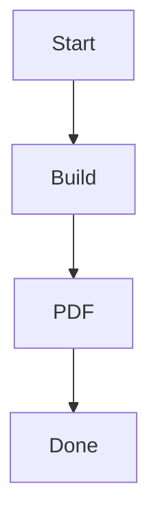

layout: title-slide
background: linear-gradient(135deg, #667eea 0%, #764ba2 100%)
align: center

@title

# HTML Slides
## Example Presentation
### Built with Markdown

---

layout: header-content

@header
## Features

@main
- Write slides in Markdown
- Syntax highlighting for code
- Math support with KaTeX
- Mermaid diagrams
- Export to PDF
- Presenter mode

---

layout: focus

@main
## Code Highlighting

```python
def greet(name: str) -> str:
    return f"Hello, {name}!"

print(greet("World"))
```

---

layout: focus

@main
## Math Equations

Inline: $E = mc^2$

Block:
$$
\sum_{i=1}^{n} i = \frac{n(n+1)}{2}
$$

---

layout: focus

@main
## Mermaid Diagrams



---

layout: title-slide
background: linear-gradient(135deg, #667eea 0%, #764ba2 100%)
align: center

@title

# Thank You!
