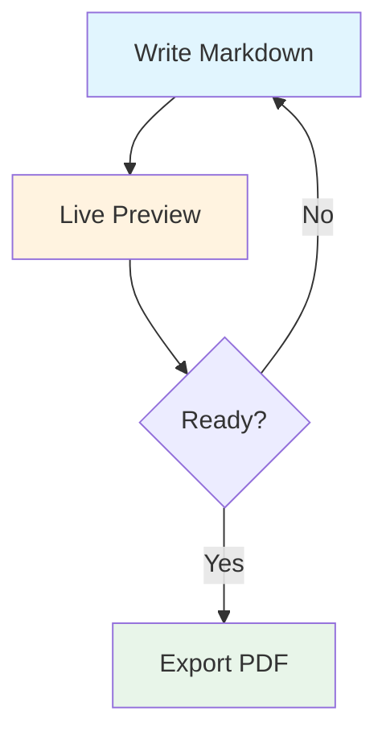

layout: title-slide

@title

# SlideMD

### Markdown-Based Presentations

Create beautiful slides with plain Markdown. No installation, no accounts, no build steps.

---

layout: two-column

@header

## What is SlideMD?

@main

An open-source tool for creating and presenting slides using plain Markdown. Built for technical educators who need code highlighting, math notation, and diagrams without the overhead of traditional presentation software.

### Features

- **Markdown syntax** with pre-made layouts
- **Live editing** with side-by-side preview
- **Presenter view** with speaker notes and timer
- **Code blocks** with syntax highlighting
- **Math rendering** via KaTeX
- **Diagrams** via Mermaid
- **Export** to PDF or standalone HTML

@media


---

layout: two-column

<!-- notes: Your talking points! Speaker notes appear only in the presenter view, not on the audience screen. -->

@header

## Quick Start

@main

### Getting Started

1. **Open your deck** – Load your `.md` file via Menu (⋮)
2. **Press `P`** – Open viewer window for your audience
3. **Move viewer** – Drag it to projector/external display
4. **Press `F`** – Go fullscreen on viewer

@media

### Essential Shortcuts

- Press **`E`** to toggle Edit Mode
- Navigate with **Arrow Keys** or **Space** or mouse scroll
- Add speaker notes using HTML comments before the `layout` tag:
  ```html
  <!-- notes: Your talking points here -->
  ```
- Notes appear only on your presenter dashboard.

---

layout: left-heavy

@header

## Slide Structure & Syntax

@main

Use `---` to separate slides. Define the layout first, then place content with `@area` markers.

| Layout           | Areas                                             |
| ---------------- | ------------------------------------------------- |
| `header-content` | `@header` `@main` `@footer`                       |
| `title-slide`    | `@title`                                          |
| `two-column`     | `@header` `@main` `@media` `@footer`              |
| `media-span`     | `@header` `@main` `@media` `@footer`              |
| `left-heavy`     | `@header` `@main` `@media` `@footer`              |
| `right-heavy`    | `@header` `@main` `@media` `@footer`              |
| `three-column`   | `@header` `@main` `@media` `@secondary` `@footer` |

@media

### Example

```markdown
layout: two-column

@header

## Slide Title

@main
Left column content.

@media
Right column content.
```

@footer

- `hidden: true` or `hide: true` skips a slide by default. Add `?showHidden=1` in the URL to override.

---

layout: left-heavy

@header

## Code, Math & Diagrams

@main

### Code Highlighting

Fenced code blocks with language identifier:

```python
def fibonacci(n: int) -> int:
    if n <= 1:
        return n
    return fibonacci(n - 1) + fibonacci(n - 2)
```

### Math with KaTeX

Inline: `$x = \frac{-b \pm \sqrt{b^2-4ac}}{2a}$` → $x = \frac{-b \pm \sqrt{b^2-4ac}}{2a}$

Block: $$\int_{-\infty}^{\infty} e^{-x^2} dx = \sqrt{\pi}$$

@media

### Mermaid Diagrams



---

background: linear-gradient(135deg, #c7d2fe 0%, #f5d0fe 100%)
layout: two-column

@header

## Edit Mode

@main

Press `E` to toggle split-screen editing with live preview.

### Editor Features

- **Live preview** – See changes instantly as you type
- **Slide thumbnails** – Jump to any slide while editing
- **Quick actions** – Add, delete, duplicate, reorder slides
- **Layout Picker** – Choose presets with filled templates
- **Autocomplete** – `layout:`, `theme:`, `@area` directives
- **Slash commands** – Type `/` for quick insertions
- **Mermaid helpers** – Insert diagram scaffolds
- **Search** – `Ctrl+F` to find within slides
- **Context menu** – Right-click thumbnails for slide operations

@media


### Visual Guides

- Area outlines show the layout grid
- Overflow warnings when content is too long
- Slide warnings for layout/area mismatches

---

layout: two-column

@header

## Speaker Notes

@main

### Adding Notes

Place an HTML comment as the **first line** of any slide, before the `layout:` directive:

```markdown
<!-- notes: Your talking points here -->

layout: two-column

@main
Slide content...
```

### Where Notes Appear

- **Presenter view** (press `P`) – Shows notes alongside current and next slide
- **Audience view** – Notes are never visible
- **PDF export** – Notes are excluded by default

@media

### Presenter Dashboard

| Panel              | Purpose                     |
| ------------------ | --------------------------- |
| **Current Slide**  | What the audience sees      |
| **Next Slide**     | Preview of upcoming content |
| **Speaker Notes**  | Your private notes          |
| **Break Controls** | Timer for breaks            |

---

layout: two-column

@header

## Images & Media

@main

### Inserting Images

**Drag and drop** an image directly onto a slide in Edit Mode, or use the image picker from the toolbar.

### Resizing & Positioning

- Drag corner handles to resize
- Double-click to reset to original size
- Use the properties panel for precise dimensions
- Images can be placed in any `@area` column
- **Drag reorder**: Drag images across columns to reposition them in the markdown
- **Position presets**: Use preset positions for quick image placement

### Background Images

Add `background: url(...)` to slide frontmatter for full-slide backgrounds:

```yaml
background: url(../public/hero.png)
```

@media

### Image Tips

- Use `../public/` for project images
- Supported formats: PNG, JPG, SVG, GIF, TIFF
- Images auto-scale to fit the slide area
- Combine with `theme: dark` for overlay effects

### Supported Sources

- **Local files** – Drag from file explorer
- **URLs** – ``
- **Relative paths** – ``
- **PPTX Import** – Images extracted from PowerPoint presentations

---

layout: two-column

@header

## Self-Contained .smd Format

@main

### What is .smd?

A self-contained presentation format that bundles your markdown deck and all images into a single file. Perfect for sharing presentations without worrying about image dependencies.

### Features

- **Single file**: Deck + images in one portable file
- **ZIP-based**: Uses JSZip with STORE compression
- **Cross-platform**: Works on any operating system
- **Backward compatible**: Still supports `.md` files

### Usage

- **Open .smd files** via Menu → Open Deck
- **Save as .smd** via Menu → Save As → .smd format
- **Import from .smd** files created by other users

@media

### Open Deck Modal

The Open Deck modal provides two ways to open presentations:

1. **Open .smd** – For self-contained bundles with images
2. **Open .md** – For remote markdown files (requires URL)

### Recent Decks

The modal remembers your recently opened decks for quick access.

### File System Access

On Chromium browsers, uses the File System Access API for seamless file management. Falls back to `<input>` on Safari/Firefox.

---

layout: two-column

@header

## PPTX Import

@main

### Convert PowerPoint to SlideMD

Import existing PowerPoint presentations and convert them to SlideMD format with automatic layout detection.

### Features

- **Layout detection**: Automatic two-column, title, and content layouts
- **Image extraction**: Pulls images from PPTX and embeds them
- **Code block detection**: Identifies monospace text as code
- **Dark theme detection**: Auto-sets theme when background is dark
- **Per-deck folder**: Organizes imported files in dedicated folders

### How to Import

1. Click Menu → Import PPTX
2. Select your PowerPoint file
3. Review conversion settings
4. Click Convert
5. Edit mode opens for manual cleanup

@media

### Conversion Options

- **Keep backgrounds**: Preserve slide backgrounds
- **Import images**: Extract and embed images
- **Language detection**: Auto-detect code languages

### Layout Detection

SlideMD uses intelligent layout detection:

- **Two-column**: Images positioned in right column
- **Title slides**: Large centered text
- **Content slides**: Headers with bullet points
- **Code slides**: Monospace text blocks

### Post-Conversion

After import, you can:

- Edit the converted markdown directly
- Adjust layouts with the layout picker
- Fine-tune image positions
- Add speaker notes

---

layout: two-column
theme: dark
background: #3e1d5f

@header

## Custom Layouts & Themes

@main

### CSS Grid Syntax

Define custom layouts with Grid. Add `minmax(0, 1fr)` to content Rows.

```markdown
layout: "header header" "main media" / 2fr 1fr
```

### Tips

- Use `.` for empty grid cells
- Column sizes: `fr`, `px`, `%`, `auto`
- Theme modes: `theme: dark` or `theme: light`
- Background: `#hex`, `linear-gradient(...)`, or `url(...)`

@media

### Examples

**Two equal columns:**

```yaml
layout: "left right" / 1fr 1fr
```

**Fixed Width Centered:**

```yaml
layout: "header" auto "main" 1fr / 800px
```

**Hidden Slide:**

```yaml
layout: header-content
hidden: true
```

---

layout: two-column

@header

## Markdown Styling

@main

### Text Formatting

- `**Bold**` for **important concepts**
- `*Italic*` for _definitions or emphasis_
- `` `Code` `` for `filenames` and commands
- `[Links](https://example.com)` for references
- `~~Strikethrough~~` for ~~removed content~~

### Lists

**Unordered** – Use for related points:

- Use `-` at the beginning of the line

**Ordered** – For sequences:

1. Use item number followed by dot at the beginning of the line

@media

### Tables

| Feature           | Support   |
| ----------------- | --------- |
| Code highlighting | Prism.js  |
| Math rendering    | KaTeX     |
| Diagrams          | Mermaid   |
| Export            | PDF, HTML |

### Blockquotes

Use for key takeaways and callouts:

> **Pro tip:** Combine markdown with inline HTML for custom styling when needed.

---

layout: two-column

@header

## Presentation Flow

@main

### The Presenter Dashboard

When you open SlideMD, you see the presenter dashboard with:

| Panel              | Purpose                     |
| ------------------ | --------------------------- |
| **Current Slide**  | What the audience sees      |
| **Next Slide**     | Preview of upcoming content |
| **Speaker Notes**  | Your private notes          |
| **Break Controls** | Timer for breaks            |

@media

### Typical Workflow

1. **Open your deck** – Load your `.md` file
2. **Press `P`** – Open viewer window for audience
3. **Drag to second screen** – Move to projector/display
4. **Press `F`** – Go fullscreen on viewer
5. **Present** – Navigate with arrow keys or space

> _The break timer shows your audience when you'll return based on the selected duration (5-15 minutes)._

---

layout: two-column

@header

## Keyboard Shortcuts Reference

@main

### Navigation

| Key               | Action                    |
| ----------------- | ------------------------- |
| `→` / `Space`     | Next slide                |
| `←` / `Backspace` | Previous slide            |
| `Home`            | First slide               |
| `End`             | Last slide                |
| `G`               | Go to slide (type number) |

@media

### Presentation Controls

| Key | Action                   |
| --- | ------------------------ |
| `P` | Open/close viewer window |
| `F` | Toggle fullscreen        |
| `E` | Toggle edit mode         |
| `B` | Start break timer        |
| `T` | Toggle dark/light theme  |
| `R` | Reload deck from file    |

---

layout: header-content

@header

## Quick Authoring Reference

@main

### Rules & Features

1. Default Layout is `header-content`
2. First `@area` defaults to `@main`. Text placed before an area also goes to `@main`.
3. Slash commands in Edit mode (`E`): Type `/` to insert layouts, areas, Mermaid diagrams, or `<!-- notes: -->` tags.
4. Auto-completion happens automatically on directives.
5. Export your presentation via Menu (⋮) → Export → PDF or HTML. Make sure to close edit mode before printing.

### Hiding slides

```markdown
layout: header-content
hidden: true

@main
This slide won't show in the viewer unless `?showHidden=1` is in the URL.
```

---

layout: header-content

@title

## Ready to Present!

@main

1. **Press `E`** – Validate slide flow and fit
2. **Press `P`** – Open viewer on your presentation display
3. **Press `F`** – Go fullscreen and deliver

### Learn More

- **README.md** – Installation and setup
- **GitHub** – Contribute, report issues, or star the project

@footer

Open source • Built for educators • Free forever
