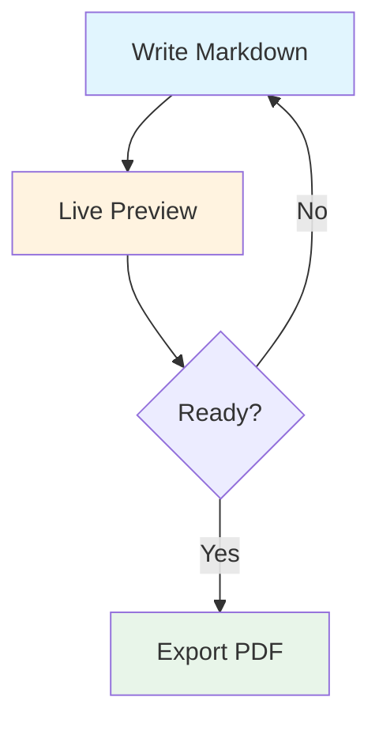

layout: title-slide

@title

# SlideMD

### Markdown-Based Presentations

Create beautiful slides with plain Markdown. No installation, no accounts, no build steps.

---

layout: header-two-column

@header

## SlideMD - Markdown-Based Presentations

@main


An open-source tool for creating and presenting slides using plain Markdown. Built for technical educators who need code highlighting, math notation, and diagrams without the overhead of traditional presentation software.

### Features

- **Markdown syntax** with pre-made layouts
- **Live editing** with side-by-side preview
- **Presenter view** with speaker notes and timer
- **Code blocks** with syntax highlighting
- **Math rendering** via KaTeX
- **Diagrams** via Mermaid
- **Export** to PDF or standalone HTML

@media


### Quick Start

- **Open File** – Menu (⋮) → Open File
- **Presenter View** – Press `P`
- **Export PDF** – Press `Ctrl+P`
- **Export HTML** – Menu (⋮) → Export HTML

---

layout: header-two-column

<!-- notes: Test speaker notes! -->

@header

## Presentation Flow

@main

The default view is your presenter dashboard with:

- **Current Slide** – What the audience sees
- **Next Slide** – Preview of upcoming content
- **Speaker Notes** – Your private notes (hidden from audience)
- **Break controls** – Open break slide with a timer

### Key Shortcuts

| Key | Action |
|-----|--------|
| `P` | Open/close viewer window |
| `F` | Toggle fullscreen |
| `B` | Start break timer |
| `D` | Toggle dark/light theme |

@media

### Typical Workflow

1. **Open your deck** – Load your `.md` file
2. **Press `P`** – Open viewer window for your audience
3. **Drag to second screen** – Move to projector/external display
4. **Press `F`** – Go fullscreen on viewer
5. **Present** – Use arrow keys or space to navigate

> *Tip: Add speaker notes using HTML comments: `<!-- notes: Your notes here -->`*


---

layout: two-column

@main

## Slide Structure & Syntax

Slides are separated by `---` and use frontmatter (the layout/theme/background lines at the top of a slide):

```markdown
layout: header-two-column

@header
## Slide Title

@main
Main content here.

@media

```

### Content Areas Examples

- `@header` – Top section (full width)
- `@main` – Primary content
- `@media` – Images, diagrams

@media

### Common Layouts

| Layout | Description |
|--------|-------------|
| `focus` | Single centered content |
| `two-column` | Equal columns |
| `left-heavy` | Wider left column |
| `header-two-column` | Header + two columns |
| `content-sidebar` | Main + sidebar |
| `title-slide` | Centered title |

---

layout: left-heavy

@main

## Code, Math & Diagrams

### Code Highlighting

Fenced code blocks with language identifier:

```python
def fibonacci(n: int) -> int:
    if n <= 1:
        return n
    return fibonacci(n - 1) + fibonacci(n - 2)
```

### Math with KaTeX

Inline: `$x = \frac{-b \pm \sqrt{b^2-4ac}}{2a}$` → $x = \frac{-b \pm \sqrt{b^2-4ac}}{2a}$

Block: $$\int_{-\infty}^{\infty} e^{-x^2} dx = \sqrt{\pi}$$

@media

### Mermaid Diagrams



---

layout: two-column
theme: dark
background: linear-gradient(135deg, #3d53b6 0%, #46216c 90%)
@main

## Custom Layouts

### Grid Syntax

Define custom layouts with CSS Grid:

```markdown
layout: "header header" "main media" / 2fr 1fr
```

**Format:** `"row1" "row2" ... / column-sizes`

### Examples

Two equal columns:
```markdown
layout: "left right" / 1fr 1fr
```

Header and footer:
```markdown
layout: "header" "content" "footer" / 1fr
```

@media

### Slide Options

```markdown
layout: focus
theme: dark
background: linear-gradient(135deg, #3d53b6 0%, #46216c 90%)
```

### Tips

- Use `.` for empty grid cells
- Column sizes: `fr`, `px`, `%`

---

layout: header-two-column

@header

## Markdown & Styling

@main

### Blockquotes

Use them for key takeaways, important reminders, and callouts.

> <span style="display: inline-block; padding: 4px 12px; background: rgba(239, 68, 68, 0.12); color: #dc2626; border-radius: 6px; margin-right: 8px;">**Warning:**</span> Add inline `<span>` styles to create highlighted warnings.

### Text Formatting

- `**Bold**` for important concepts
- `*Italic*` for definitions or emphasis
- `` `Code` `` for filenames and commands
- `[Links](https://example.com)` for references

@media

### Lists

**Unordered** (`- item`) – For related points
- Group related concepts
- Keep items parallel

**Ordered** (`1. item`) – For sequences
1. Break into steps
2. Use consistent verbs

### Custom HTML

When markdown isn't enough:
```markdown
<span style="color: #e74c3c;">
Red text
</span>
```
---

layout: header-two-column

@header

## Edit Mode

@main

Press `E` to toggle split-screen editing with live preview.

### Features

- **Live preview** – See changes instantly as you type
- **Slide thumbnails** – Jump to any slide instantly
- **Quick actions** – Add, delete, duplicate, reorder slides
- **Layout Picker** – Choose from preset layouts when adding slides

@media


---

layout: header-content

@header

## Keyboard Shortcuts

@main

| Key | Action |
|-----|--------|
| `→` / `Space` | Next slide |
| `←` | Previous slide |
| `Home` / `End` | First / Last slide |
| `G` | Go to slide (type number) |
| `F` | Toggle fullscreen |
| `E` | Toggle edit mode |
| `P` | Open/Close viewer window |
| `D` | Toggle dark/light theme |
| `R` | Reload deck from file |

---

layout: "main" "footer" / 1fr

@main

## Ready to Present!

1. **Press `E`** – Enter edit mode to experiment
2. **Press `P`** – Open viewer window for dual-screen
3. **Press `F`** – Go fullscreen and present!


### Learn More

- **`docs/authoring-examples.md`** – Advanced examples & recipes
- **GitHub** – Contribute, report issues, or star the project

@footer
Open source • Built for educators • Free forever
