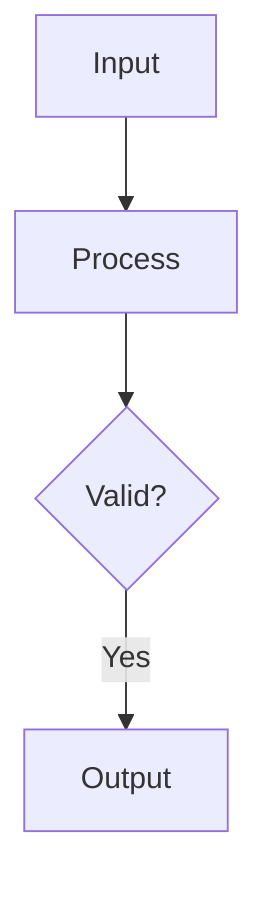
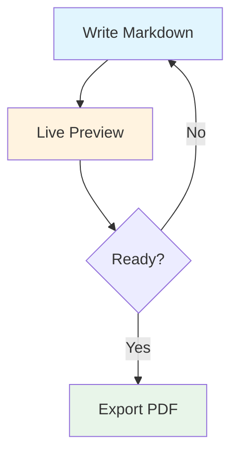

layout: header-two-column

@header

## SlideMD - Markdown-Based Presentations

@main


An open-source tool for creating and presenting slides using plain Markdown. Built for technical educators who need code highlighting, math notation, and diagrams without the overhead of traditional presentation software.

No installation, no accounts, no build steps. Your content stays on your machine.

### Features

- **Markdown syntax** with pre-made layout
- **Live editing** with side-by-side preview
- **Presenter view** with speaker notes, timer, and next slide preview
- **Code blocks** with syntax highlighting (100+ languages)
- **Math rendering** via KaTeX
- **Diagrams** via Mermaid
- **Export** to PDF or standalone HTML

@media

### Getting Started

- **Open File** – Click <div style="display: inline-block; padding: 10px; background: #e0e0e0; border-radius: 8px;"><svg width="24" height="24" viewBox="0 0 24 24" fill="none" stroke="currentColor" stroke-width="2" stroke-linecap="round" stroke-linejoin="round"><circle cx="12" cy="12" r="1"></circle><circle cx="19" cy="12" r="1"></circle><circle cx="5" cy="12" r="1"></circle></svg></div> → <div style="display: inline-block; padding: 10px; background: #e0e0e0; border-radius: 8px;"><svg width="24" height="24" viewBox="0 0 24 24" fill="none" stroke="currentColor" stroke-width="2" stroke-linecap="round" stroke-linejoin="round"><path d="M21 15v4a2 2 0 0 1-2 2H5a2 2 0 0 1-2-2v-4"></path><polyline points="17 8 12 3 7 8"></polyline><line x1="12" y1="3" x2="12" y2="15"></line></svg></div> Open File
- **Presenter View** – Press `V` to open a separate window, then move it to your projector or second screen. Press `F` to switch to full-screen view for better readability.
- **Export PDF** – Press `Ctrl+P` to print/export as PDF
- **Export HTML** – Click <div style="display: inline-block; padding: 10px; background: #e0e0e0; border-radius: 8px;"><svg width="24" height="24" viewBox="0 0 24 24" fill="none" stroke="currentColor" stroke-width="2" stroke-linecap="round" stroke-linejoin="round"><circle cx="12" cy="12" r="1"></circle><circle cx="19" cy="12" r="1"></circle><circle cx="5" cy="12" r="1"></circle></svg></div> → <div style="display: inline-block; padding: 10px; background: #e0e0e0; border-radius: 8px;"><svg width="24" height="24" viewBox="0 0 24 24" fill="none" stroke="currentColor" stroke-width="2" stroke-linecap="round" stroke-linejoin="round"><path d="M21 15v4a2 2 0 0 1-2 2H5a2 2 0 0 1-2-2v-4"></path><polyline points="7 10 12 15 17 10"></polyline><line x1="12" y1="15" x2="12" y2="3"></line></svg></div> Export as standalone HTML

---

layout: header-content

@header

## Keyboard Shortcuts

@main

| Key | Action |
|-----|--------|
| `→` / `PgDn` / `Space` | Next slide |
| `←` / `PgUp` / `Backspace` | Previous slide |
| `Home` / `End` | First / Last slide |
| `G` | Go to slide (type number) |
| `F` | Toggle fullscreen |
| `E` | Toggle edit mode |
| `V` | Open Viewer window |
| `D` | Toggle dark/light theme |
| `R` | Reload deck from file |

---

layout: two-column

@main

## Slide Structure & Syntax

### Basic Structure

Slides are separated by `---` and use frontmatter to define layout:

```markdown
layout: header-two-column

@header
## Slide Title

@main
Main content goes here.

@media


---

layout: two-column

@main
# Next slide content
```

### Content Areas

- `@header` – Top section (full width)
- `@main` – Primary content area
- `@media` – Images, diagrams, secondary content
- `@sidebar` – Narrow side column

Different layouts use different combinations of these areas.

@media

### Layout Presets

| Layout | Areas Used |
|--------|------------|
| `focus` | Single centered content |
| `two-column` | Left and right columns (equal) |
| `left-heavy` | Wider left, narrower right |
| `right-heavy` | Wider right, narrower left |
| `header-content` | Header + main area |
| `header-two-column` | Header + two columns |
| `content-sidebar` | Main + narrow sidebar |
| `sidebar-content` | Narrow sidebar + main |
| `three-column` | Three equal columns |
| `title-slide` | Centered title page |

---

layout: left-heavy

@main

## Code, Math & Diagrams

### Code Highlighting

Fenced code blocks with language identifier:

```python
def fibonacci(n: int) -> int:
    if n <= 1:
        return n
    return fibonacci(n - 1) + fibonacci(n - 2)

for i in range(10):
    print(f"F({i}) = {fibonacci(i)}")
```

### Math with KaTeX

Inline: `$x = \frac{-b \pm \sqrt{b^2-4ac}}{2a}$`

Renders as: $x = \frac{-b \pm \sqrt{b^2-4ac}}{2a}$

Block:

$$\int_{-\infty}^{\infty} e^{-x^2} dx = \sqrt{\pi}$$

@media

### Mermaid Diagrams

<div style="height: 450px; overflow-y: hidden;">

````markdown

````

</div>



---

layout: two-column
theme: dark
background: linear-gradient(135deg, #3d53b6 0%, #46216c 100%)
@main

## Custom Layouts

### Grid Syntax

Define custom layouts using CSS Grid syntax:

```markdown
layout: "header header" "main media" / 2fr 1fr
```

**Format:** `"row1" "row2" ... / column-sizes`

### Examples

Two equal columns:
```markdown
layout: "left right" / 1fr 1fr
```

Narrow centered content:
```markdown
layout: "main" / 800px
```

Header and footer:
```markdown
layout: "header" "content" "footer" / 1fr
```

@media

### Slide Options

```markdown
layout: focus
theme: dark            # dark or light
background: #080f42  # custom background color
```

### Tips

Custom layouts give you full control over slide structure.

Use `.` for empty grid cells to create spacing.

Column sizes use CSS units: `fr`, `px`, `%`, etc.

---

layout: header-content

@header

## HTML & Inline Styling

@main

### Callout Boxes

Use HTML when you need custom styling:

<div style="font-size: 1.4rem; background: #e8f4fd; border-left: 4px solid #2196f3; padding: 16px; margin: 16px 0;">
  <strong>Note:</strong> This is an informational callout box using inline styles.
</div>

<div style="font-size: 1.4rem; background: #fff3cd; border-left: 4px solid #ffc107; padding: 16px; margin: 16px 0;">
  <strong>Warning:</strong> Great for emphasizing important points.
</div>

<div style="font-size: 1.4rem; background: #d4edda; border-left: 4px solid #28a745; padding: 16px; margin: 16px 0;">
  <strong>Success:</strong> Perfect for highlighting achievements or key takeaways.
</div>

### Inline Styling

Regular markdown with <span style="color: #e74c3c; font-weight: bold;">red bold</span> and <span style="background: #fff3cd; padding: 4px 8px; border-radius: 4px;">highlighted</span> text.

### Styled Tables

<table style="width: 100%; border-collapse: collapse;">
  <tr style="background: #3498db; color: white;">
    <th style="padding: 10px; text-align: left;">Feature</th>
    <th style="padding: 10px; text-align: left;">Status</th>
  </tr>
  <tr style="background: #ecf0f1;">
    <td style="padding: 10px;">Markdown</td>
    <td style="padding: 10px; color: green;">✓ Built-in</td>
  </tr>
  <tr style="background: #fff;">
    <td style="padding: 10px;">HTML</td>
    <td style="padding: 10px; color: green;">✓ Supported</td>
  </tr>
</table>

---

layout: header-two-column

@header

## Edit Mode

@main

### Entering Edit Mode

Press `E` or click the edit icon in the toolbar.

### Features

**Split View** – Markdown editor on left, live preview on right

**Slide Navigation** – Thumbnail list with quick jumping

**Slide Management** – Add, delete, duplicate, and reorder slides

**Layout Picker** – Select from preset layouts when creating slides

**Auto-tracking** – Unsaved changes indicator

### Workflow

1. Open a `.md` file (or URL)
2. Press `E` to enter edit mode
3. Modify content in the editor
4. Preview updates automatically
5. Use slide actions to manage deck
6. Save with `Ctrl+S` or the Save button

@media

### Slide Actions

| Action | Description |
|--------|-------------|
| **Add** | Insert new slide |
| **Delete** | Remove current slide |
| **Duplicate** | Copy current slide |
| **Move Up/Down** | Reorder slides |
| **Save** | Export to `.md` file |

### Tips

Edit mode is useful for building decks from scratch or making quick fixes before presenting.

Changes are temporary until you save.

---

layout: header-two-column

@header

## Presenter Mode & Export

@main

### Presenter Mode

Press `P` to open a separate presenter window with:

- **Current Slide** – What the audience sees
- **Next Slide** – Preview of upcoming content
- **Speaker Notes** – Your private notes (hidden from audience)
- **Timer** – Elapsed time tracking
- **Progress** – Slide counter

### Adding Speaker Notes

```markdown
@main
## Topic Introduction

Content visible to audience.

<!-- notes: Remember to mention the prerequisite.
Ask if there are questions before moving on. -->
```

Notes are only visible in presenter mode.

@media

### Export Options

**PDF Export**  
Press `Ctrl+P` or `E` to print/save as PDF  
Good for handouts or archiving

**HTML Export**  
Click <div style="display: inline-block; padding: 10px; background: #e0e0e0; border-radius: 8px;"><svg width="24" height="24" viewBox="0 0 24 24" fill="none" stroke="currentColor" stroke-width="2" stroke-linecap="round" stroke-linejoin="round"><circle cx="12" cy="12" r="1"></circle><circle cx="19" cy="12" r="1"></circle><circle cx="5" cy="12" r="1"></circle></svg></div> → Export HTML  
Creates standalone file (viewer mode only)  
Works offline, no server needed

### Presenter Shortcuts

| Key | Action |
|-----|--------|
| `D` | Toggle theme |
| `B` | Start break timer |

---

layout: focus

@main

## Ready to Start

Open your `.md` file and press `E` to edit or `F` to present.

Check `docs/authoring-examples.md` for more examples and recipes.

*Open source project – contribute or adapt as needed.*
