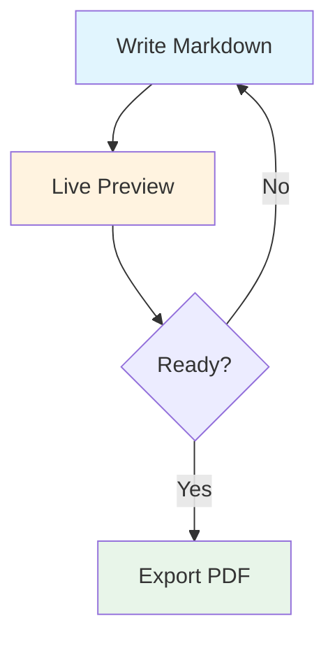
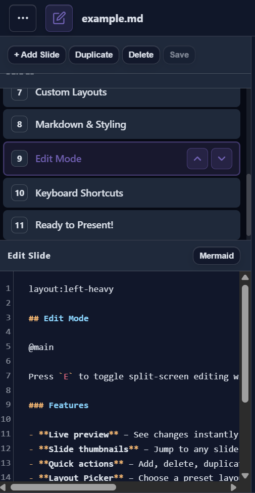

layout: title-slide

@title

# SlideMD

### Markdown-Based Presentations

Create beautiful slides with plain Markdown. No installation, no accounts, no build steps.

---

layout: header-two-column

@header

## What is SlideMD?

@main

An open-source tool for creating and presenting slides using plain Markdown. Built for technical educators who need code highlighting, math notation, and diagrams without the overhead of traditional presentation software.

### Features

- **Markdown syntax** with pre-made layouts
- **Live editing** with side-by-side preview
- **Presenter view** with speaker notes and timer
- **Code blocks** with syntax highlighting
- **Math rendering** via KaTeX
- **Diagrams** via Mermaid
- **Export** to PDF or standalone HTML

@media


---

layout: header-content

@header

## Quick Start

@main

### Getting Started in 4 Steps

1. **Open your deck** – Load your `.md` file via Menu (⋮) → Open File
2. **Press `P`** – Open viewer window for your audience
3. **Drag to second screen** – Move to projector/external display
4. **Press `F`** – Go fullscreen on viewer, then present with arrow keys!

### Essential Shortcuts

| Key | Action |
|-----|--------|
| `P` | Open/close viewer window |
| `E` | Toggle edit mode |
| `F` | Toggle fullscreen |
| `B` | Start break timer |
| `D` | Toggle dark/light theme |
| `R` | Reload deck from file |

> *Tip: Add speaker notes using HTML comments: `<!-- notes: Your notes here -->`*

---

layout: left-heavy

@header

## Slide Structure & Syntax

@main

Slides are separated by `---`. Use frontmatter for layout, then `@area` markers to place content:


### Layout → Areas

| Layout | Areas |
|--------|-------|
| `focus` | `@header` `@main` |
| `two-column` | `@header` `@main` `@media` |
| `left-heavy` / `right-heavy` | `@header` `@main` `@media` |
| `header-content` | `@header` `@main` `@footer` |
| `title-slide` | `@title` |
| `three-column` | `@header` `@main` `@media` `@secondary` |
| `header-two-column` | `@header` `@main` `@media` `@footer` |

@media

### Example

```markdown
layout: two-column

@header
## Slide Title

@main
Left column content.

@media
Right column content.
```

---

layout: left-heavy

@header

## Code, Math & Diagrams

@main

### Code Highlighting

Fenced code blocks with language identifier:

```python
def fibonacci(n: int) -> int:
    if n <= 1:
        return n
    return fibonacci(n - 1) + fibonacci(n - 2)
```

### Math with KaTeX

Inline: `$x = \frac{-b \pm \sqrt{b^2-4ac}}{2a}$` → $x = \frac{-b \pm \sqrt{b^2-4ac}}{2a}$

Block: $$\int_{-\infty}^{\infty} e^{-x^2} dx = \sqrt{\pi}$$

@media

### Mermaid Diagrams



---

layout: header-two-column

@header

## Edit Mode

@main

Press `E` to toggle split-screen editing with live preview.

### Editor Features

- **Live preview** – See changes instantly as you type
- **Slide thumbnails** – Jump to any slide while editing
- **Quick actions** – Add, delete, duplicate, reorder slides
- **Layout Picker** – Choose presets with filled templates
- **Autocomplete** – `layout:`, `theme:`, `@area` directives
- **Slash commands** – Type `/` for quick insertions
- **Mermaid helpers** – Insert diagram scaffolds
- **Search** – `Ctrl+F` to find within slides

@media



### Visual Guides

- Area outlines show the layout grid
- Overflow warnings when content is too long
- Slide warnings for layout/area mismatches

---

layout: two-column
theme: dark
background: #3e1d5f

@header

## Custom Layouts & Themes

@main

### Grid Syntax

Define custom layouts with CSS Grid:

```markdown
layout: "header header" "main media" / 2fr 1fr
```

**Format:** `"row1" "row2" / column-sizes`

### Slide Options

```markdown
layout: focus
theme: dark
background: #3e1d5f
```

### Tips

- Use `.` for empty grid cells
- Column sizes: `fr`, `px`, `%`, `auto`
- `theme: dark` or `theme: light`
- Background accepts colors, gradients, or image URLs

@media

### Layout Examples

**Two equal columns:**
```markdown
layout: "left right" / 1fr 1fr
```

**Header, content, footer:**
```markdown
layout: "header" "main" "footer" / 1fr
```

**Three rows, two columns:**
```markdown
layout: "header header"
       "main sidebar"
       "footer footer" / 3fr 1fr
```

---

layout: header-two-column

@header

## Markdown Styling

@main

### Text Formatting

- `**Bold**` for **important concepts**
- `*Italic*` for *definitions or emphasis*
- `` `Code` `` for `filenames` and commands
- `[Links](https://example.com)` for references
- `~~Strikethrough~~` for ~~removed content~~

### Lists

**Unordered** – For related points:
- Keep items parallel
- Group related concepts

**Ordered** – For sequences:
1. Break into steps
2. Use consistent verbs

@media

### Tables

| Feature | Support |
|---------|---------|
| Code highlighting | Prism.js |
| Math rendering | KaTeX |
| Diagrams | Mermaid |
| Export | PDF, HTML |


### Blockquotes

Use for key takeaways and callouts:

> **Pro tip:** Combine markdown with inline HTML for custom styling when needed.


---

layout: header-two-column

@header

## Presentation Flow

@main

### The Presenter Dashboard

When you open SlideMD, you see the presenter dashboard with:

| Panel | Purpose |
|-------|---------|
| **Current Slide** | What the audience sees |
| **Next Slide** | Preview of upcoming content |
| **Speaker Notes** | Your private notes |
| **Break Controls** | Timer for breaks |

@media
### Typical Workflow

1. **Open your deck** – Load your `.md` file
2. **Press `P`** – Open viewer window for audience
3. **Drag to second screen** – Move to projector/display
4. **Press `F`** – Go fullscreen on viewer
5. **Present** – Navigate with arrow keys or space

> *The break timer shows your audience when you'll return based on the selected duration (5-15 minutes).*

---

layout: header-two-column

@header

## Keyboard Shortcuts Reference

@main

### Navigation

| Key | Action |
|-----|--------|
| `→` / `Space` / `PageDown` | Next slide |
| `←` / `PageUp` / `Backspace` | Previous slide |
| `Home` | First slide |
| `End` | Last slide |
| `G` | Go to slide (type number) |

@media
### Presentation Controls

| Key | Action |
|-----|--------|
| `P` | Open/close viewer window |
| `F` | Toggle fullscreen |
| `E` | Toggle edit mode |
| `B` | Start break timer |
| `D` | Toggle dark/light theme |
| `R` | Reload deck from file |

---

layout: "main" "footer" / 1fr

@main

## Ready to Present!

1. **Press `E`** – Enter edit mode to experiment
2. **Press `P`** – Open viewer window for dual-screen
3. **Press `F`** – Go fullscreen and present!


### Learn More

- **`docs/authoring-examples.md`** – Advanced examples & recipes
- **GitHub** – Contribute, report issues, or star the project

@footer

Open source • Built for educators • Free forever