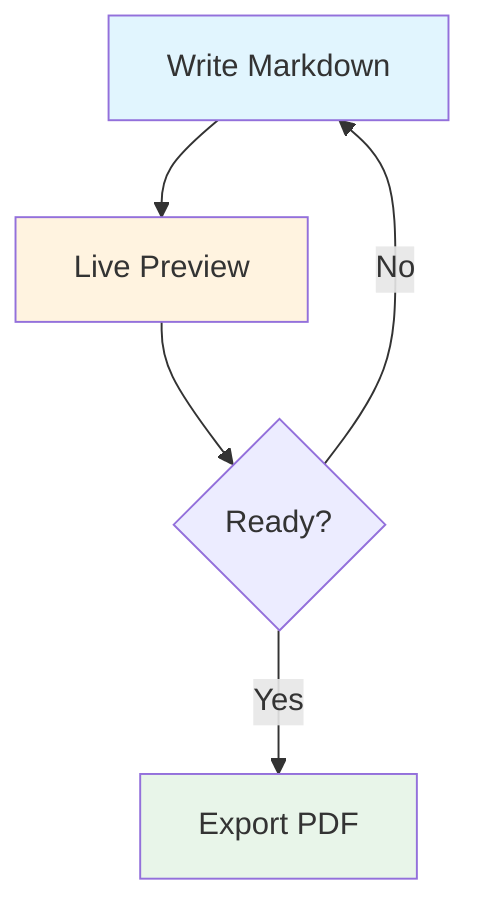
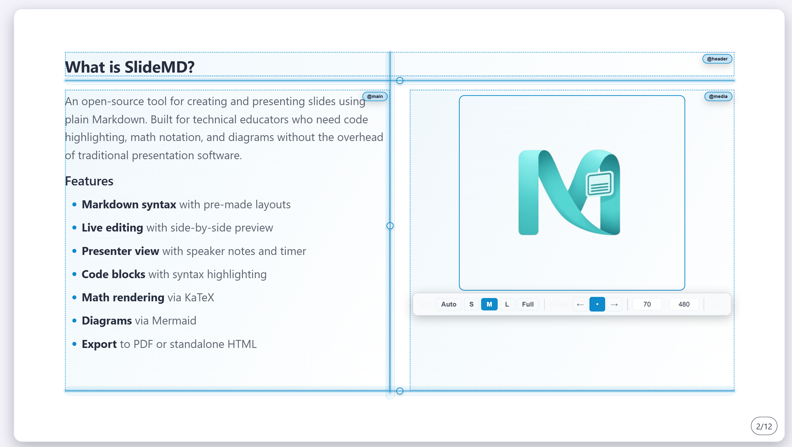
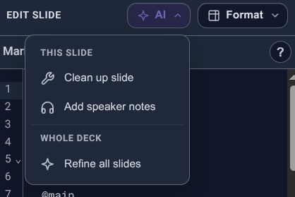

layout: title-slide

@title

# Welcome to SlideMD

### Markdown-Based Presentations

### Create beautiful slides with plain Markdown.

---

layout: media-span-right
@header

# What is SlideMD?

@main

An open-source tool for creating and presenting slides using plain Markdown. Built for technical educators who need code highlighting, math notation, and diagrams without the overhead of traditional presentation software.

### Features

- **Markdown syntax** with pre-made layouts
- **Live editing** with side-by-side preview
- **Presenter view** with speaker notes and timer
- **Code blocks** with syntax highlighting
- **Math rendering** via KaTeX
- **Diagrams** via Mermaid
- **Export** to PDF or standalone HTML

@media


---

layout: two-column

<!-- notes: Your talking points! Speaker notes appear only in the presenter view, not on the audience screen. -->

@header

# Quick Start

@main

### Getting Started

1. **Open your deck** – Load a `.md` or `.textpack` file via Menu → Open File
2. **Press `P`** – Open viewer window for your audience
3. **Move viewer** – Drag it to projector/external display
4. **Press `F`** – Go fullscreen on viewer

@media

### Essential Shortcuts

- Press **`E`** to toggle Edit Mode
- Press **`Ctrl+K`** (`**Cmd+K**` on Mac) to open the **Command Palette**
- Press **`/`** or **`Ctrl+Shift+F`** (`**Cmd+Shift+F**` on Mac) to search across slides
- Navigate with **Arrow Keys** or **Space** or mouse scroll
- Add speaker notes using HTML comments before the `layout` tag:
  ```html
  <!-- notes: Your talking points here -->
  ```
- Notes appear only on your presenter dashboard.

---

layout: "header header" auto "main media" minmax(0, 1fr) "footer footer" auto / 2.1872fr 0.8128fr
@header

# Slide Structure & Syntax

@main

| Layout                                 | Areas                                             |
| -------------------------------------- | ------------------------------------------------- |
| `header-content`                       | `@header` `@main` `@footer`                       |
| `title-slide`                          | `@title`                                          |
| `focus`                                | `@header` `@main` `@footer`                       |
| `full-image`                           | `@main`                                           |
| `two-column`                           | `@header` `@main` `@media` `@footer`              |
| `media-span-left` / `media-span-right` | `@header` `@main` `@media` `@footer`              |
| `left-heavy` / `right-heavy`           | `@header` `@main` `@media` `@footer`              |
| `three-column`                         | `@header` `@main` `@media` `@secondary` `@footer` |

@media

Use `---` to separate slides. Define the layout first, then place content with `@area` markers.

### Example

```markdown
layout: two-column

@header

# Slide Title

@main
Left column content.

@media
Right column content.
```

@footer

`hidden: true` or `hide: true` skips a slide by default. Add `?showHidden=1` in the URL to override.

---

layout: "header media" "main media" "footer media" / 2fr 1fr
@header

# Code, Math & Diagrams

@main

### Code Highlighting

Fenced code blocks with language identifier:

```python
def fibonacci(n: int) -> int:
    if n <= 1:
        return n
    return fibonacci(n - 1) + fibonacci(n - 2)
```

### Math with KaTeX

Inline: `$x = \frac{-b \pm \sqrt{b^2-4ac}}{2a}$` → $x = \frac{-b \pm \sqrt{b^2-4ac}}{2a}$

Block: $$\int_{-\infty}^{\infty} e^{-x^2} dx = \sqrt{\pi}$$

@media

### Mermaid Diagrams



---

background: linear-gradient(135deg, #c7d2fe 0%, #f5d0fe 100%)

layout: two-column

@header

# Edit Mode

@main

Press `E` to toggle split-screen editing with live preview.

### Writing Tools

- **Live preview:** See changes instantly as you type
- **Auto-save:** Silent debounced save to disk
- **Ctrl+S** (`Cmd+S`): Instant save from anywhere
- **Autocomplete:** `layout:`, `theme:`, `@media` directives
- **Slash commands:** Type `/` for quick insertions
- **Search:** `Ctrl+Shift+F` to search across all slides

### Slide Management

- **Slide thumbnails:** Jump to any slide while editing
- **Quick actions:** Add, delete, duplicate, reorder slides
- **Layout Picker:** Choose presets with filled templates
- **Context menu:** Right-click thumbnails for slide operations

@media



### Visual Guides

- Area outlines show the layout grid
- Overflow warnings when content is too long
- Slide warnings for layout/area mismatches

---

layout: two-column

@header

# Speaker Notes

@main

### Adding Notes

Place an HTML comment as the **first line** of any slide, before the `layout:` directive:

```markdown
<!-- notes: Your talking points here -->

layout: two-column

@main
Slide content...
```

### Where Notes Appear

- **Presenter view** (press `P`) – Shows notes alongside current and next slide
- **Audience view** – Notes are never visible
- **PDF export** – Notes are excluded by default

@media

### Presenter Dashboard

| Panel              | Purpose                |
| ------------------ | ---------------------- |
| **Current Slide**  | What the audience sees |
| **Speaker Notes**  | Your private notes     |
| **Break Controls** | Timer for breaks       |

---

layout: two-column

@header

# Images & Media

@main

To **insert an image**, drag and drop it onto a slide in Edit Mode, or use the image picker from the toolbar.

### Resizing & Positioning

- Drag corner handles to resize
- Double-click to reset to original size
- Use the properties panel for precise dimensions
- Drag images across columns to reorder them in the markdown

### Background Images

Add `background: url(...)` to slide frontmatter for full-slide backgrounds.

### Media Full-Bleed

Make `@media` span the full slide height edge-to-edge with `media-full-bleed: true`.

@media

### How Images Work

- **In .textpack files** – Images are stored in the `assets/` folder inside the archive. When opened with the CLI dev server, images are uploaded to the server.
- **In .md files** – Use full URLs (`https://...`). Relative paths like `images/photo.png` work when served by the dev server.

### Formats

- PNG, JPG, SVG, GIF
- Images auto-scale to fit the slide area
- Combine with `theme: dark` for overlay effects

---

layout: two-column

@header

# Supported File Formats

@main

### Opening Decks

| Format        | Description                                                |
| ------------- | ---------------------------------------------------------- |
| **.md**       | Plain Markdown with frontmatter. Use full URLs for images. |
| **.textpack** | ZIP with `text.markdown` + `assets/`. Self-contained.      |

### Exporting

- **HTML** – Standalone file with all assets inlined. Share or host anywhere.
- **PDF** – One-click export via Menu → Export, or use the CLI build + PDF tools.
- **.textpack** – Package your deck with images into a single shareable archive.

@media

### Open Deck Workflow

1. **Menu → Open File** – Load `.md` or `.textpack`
2. **Recent Decks** – Quickly reopen recent presentations from the modal
3. **CLI dev server** – `npm run dev:cli` serves your deck with live reload

### PPTX Import

- Import PowerPoint files via Menu → Import PPTX
- Preserves the original slide order from the presentation
- Extracts images into an `images/` folder
- Converts slide content to Markdown with layout inference
- Original `.pptx` is not modified
- Import is instant — refine slides with AI editing afterward

---

layout: two-column

@header

# AI Editing

@main

Let the AI handle the busywork so you can focus on the message.

### Single Slide

- **Enhance slide** — polish formatting, headers, code blocks, and layout in one click
- **Add speaker notes** — generate speaker notes without touching the slide


@media

### Whole Deck

- **Polish** — fix formatting, wording, and layouts. Keeps slide count and order.
- **Remix** — reorder, merge, or rewrite slides. AI proposes an outline to preview.
- **Reimagine** — bold new direction with editable outline before generating.
- **Vision** — send content images to the AI for visual-aware restructuring.
- **Options** — choose Flow, add speaker notes, or preserve visual identity for Remix.

Set up your provider in **Settings**, open the **AI dropdown**, and try any action. `Ctrl+Z` undoes the result.

---

layout: two-column
theme: dark
background: #3e1d5f

@header

# Custom Layouts & Themes

@main

### CSS Grid Syntax

Define custom layouts with Grid. Add `minmax(0, 1fr)` to content Rows.

```yaml
layout: "header header" "main media" / 2fr 1fr
```

### Tips

- Use `.` for empty grid cells
- Column sizes: `fr`, `px`, `%`, `auto`
- Theme modes: `theme: dark` or `theme: light`
- Background: `#hex`, `linear-gradient(...)`, or `url(...)`

@media

### Examples

**Two equal columns:**

```yaml
layout: "left right" / 1fr 1fr
```

**Fixed Width Centered:**

```yaml
layout: "header" auto "main" 1fr / 800px
```

**Hidden Slide:**

```yaml
layout: header-content
hidden: true
```

---

layout: two-column

@header

# Markdown Styling

@main

### Text Formatting

- `**Bold**` for **important concepts**
- `*Italic*` for _definitions or emphasis_
- `` `Code` `` for `filenames` and commands
- `[Links](https://example.com)` for references
- `~~Strikethrough~~` for ~~removed content~~

### Lists

**Unordered** – Use for related points:

- Use `-` at the beginning of the line

**Ordered** – For sequences:

1. Use item number followed by dot at the beginning of the line

@media

### Blockquotes

Use for key takeaways and callouts:

> **Pro tip:** Combine markdown with inline HTML for custom styling when needed.

### Code Spans

Use `` `backticks` `` for `inline code` within sentences.

---

layout: two-column

@header

# Presentation Flow

@main

### Typical Workflow

1. **Open your deck** – Load your `.md` file
2. **Press `P`** – Open viewer window for audience
3. **Drag to second screen** – Move to projector/display
4. **Press `F`** – Go fullscreen on viewer
5. **Present** – Navigate with arrow keys or space

> _On Mac, Chromium browsers (Chrome, Brave, Edge) may open the viewer as a tab instead of a window when the browser is maximized. Un-maximize the browser window before pressing `P`, or drag the tab out to detach it._

> _The break timer shows your audience when you'll return based on the selected duration (5-15 minutes)._

@media

### Presenter Dashboard

When you open SlideMD, you see the presenter dashboard with:

- **Current Slide** – What the audience sees
- **Speaker Notes** – Your private notes
- **Break Controls** – Timer for breaks

---

layout: two-column

@header

# Keyboard Shortcuts Reference

@main

### Navigation

| Key               | Action                    |
| ----------------- | ------------------------- |
| `→` / `Space`     | Next slide                |
| `←` / `Backspace` | Previous slide            |
| `Home`            | First slide               |
| `End`             | Last slide                |
| `G`               | Go to slide (type number) |

@media

### Presentation Controls

| Key | Action                   |
| --- | ------------------------ |
| `P` | Open/close viewer window |
| `F` | Toggle fullscreen        |
| `E` | Toggle edit mode         |
| `B` | Start break timer        |
| `T` | Toggle dark/light theme  |
| `R` | Reload deck from file    |

---

layout: header-content

@header

# Quick Authoring Reference

@main

### Rules & Features

1. Default Layout is `header-content`
2. First `@area` defaults to `@main`. Text placed before an area also goes to `@main`.
3. Slash commands in Edit mode (`E`): Type `/` to insert layouts, areas, Mermaid diagrams, or `<!-- notes: -->` tags.
4. Auto-completion happens automatically on directives.
5. Export your presentation via Menu (⋮) → Export → PDF or HTML. Make sure to close edit mode before printing.

### Hiding slides

```markdown
layout: header-content
hidden: true

@main
This slide won't show in the viewer unless `?showHidden=1` is in the URL.
```

---

layout: two-column
@header

# Text Blocks

@main

Use `::: text-block { ... }` to wrap content with custom styling. Attributes are space-separated.

### Available Attributes

| Attribute      | Effect             |
| -------------- | ------------------ |
| `column-count` | Multi-column flow  |
| `font-size`    | Override text size |
| `color`        | Text color         |
| `background`   | Background color   |
| `padding`      | Inner padding      |
| `markdown`     | Render markdown    |

@media

### Multi-column

::: text-block { column-count=2 }

1. First item
2. Second item
3. Third item
4. Fourth item

:::

### Styled block

::: text-block { color="#1a95b8" markdown=true }

**Bold text** and _italic_ inside a styled block.

:::

---

layout: left-heavy

@header

# Table Styling

@main

Use `::: table { ... }` to wrap a markdown table with sizing, alignment, and styling. Attributes use `key=value` syntax (not `key: value`).

| Attribute     | Default | Description                                 |
| ------------- | ------- | ------------------------------------------- |
| `width`       | auto    | Percentage of area (1–100)                  |
| `align`       | center  | `left`, `center`, or `right`                |
| `fontSize`    | inherit | Font size in px                             |
| `columns`     | auto    | Relative column weights (e.g. `2,1,3`)      |
| `borders`     | true    | `false` removes the table border            |
| `striped`     | true    | `false` disables zebra striping             |
| `headerColor` | auto    | Hex color for header row (e.g. `"#003C68"`) |
| `no-header`   | off     | Bare flag; hides the header row             |

@media

### Styled Example

::: table { fontSize=20 headerColor="#1a95b8" striped=false }

| Feature           | Support   |
| ----------------- | --------- |
| Code highlighting | Prism.js  |
| Math rendering    | KaTeX     |
| Diagrams          | Mermaid   |
| Export            | PDF, HTML |

:::

### Left-aligned + Borderless + Custom column width

::: table { borders=false align=left columns=2,4,8 }

| A   | B   | C   |
| --- | --- | --- |
| 1   | 2   | 3   |
| 4   | 5   | 6   |

:::

---

layout: focus

@main

# Ready to Present?

<br>

**Press `E`** – Validate slide flow and fit
**Press `P`** – Open viewer on your presentation display
**Press `F`** – Go fullscreen and deliver

### Learn More

**README.md** – Installation and setup
**GitHub** – Contribute, report issues, or star the project

@footer

Open source • Built for educators • Free forever
