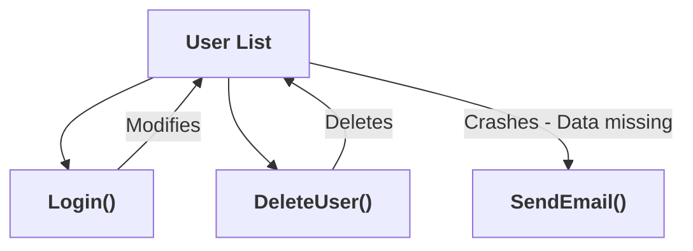
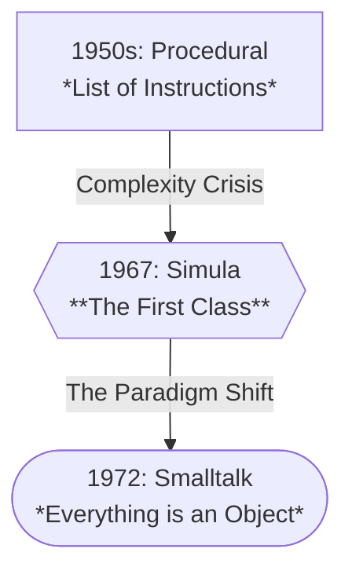
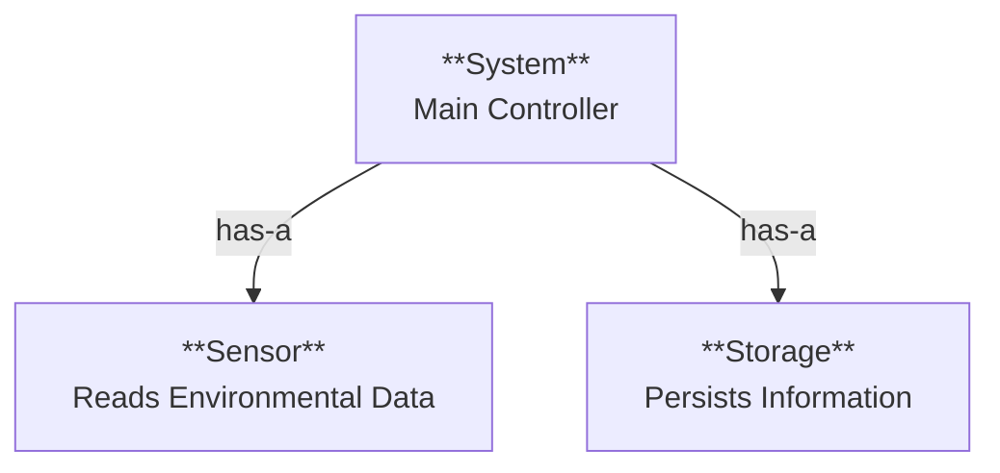

layout: title-slide
background: linear-gradient(135deg, #eae4f0 0%, #f9fcfe 100%)

@title

# Object-Oriented Design using Python

## COMP 7855 - Week 2

### Hesam Alizadeh

---

layout: header-two-column

@header

## Where We Are in the Course

@main

### Last Week (Week 1)

- **Mindset:** Systems, not scripts

- **Process:** Agile & Scrum

- **Tooling:** Git & Teams Formation

### Today (Week 2)

- **Design:** Managing complexity with OOD

- **Reliability:** Protecting state with Encapsulation

- **Flexibility:** Interfaces & Polymorphism

@media

### Coming Up

- **Week 3**: Requirements Engineering

- **Week 4**: System Architecture & Design

---

layout: header-content

@header

## By the end of today you can...

@main

- Move from writing linear scripts to designing modular object-oriented systems

- Apply **encapsulation** techniques to protect object state and enforce rules

- Evaluate when to use **inheritance** versus **composition** to create flexible architectures

- Implement professional Python standards including **Type Hinting**, **Docstrings**, and **Magic Methods**

- Construct resilient code using proper **error handling** patterns to prevent crashes

---

layout: two-column

@main

### The Problem

- Scripts work for 100 lines. They fail at 10,000 lines

- Data is often global or passed endlessly between functions.

- It becomes hard to track who is changing what.

- Distributed systems have multiple modules talking over networks

## The "Systems" Problem

### Why scripts don't scale

> If changing one feature forces you to edit 10 unrelated files, your design is the problem, not your coding skills.



---

layout: "header" "main" / 1fr

@header

## The Solution: Object Oriented Design

@main

> OOP changes the mental model. Instead of "Functions" and "Variables", we have Objects.

It helps you manage:

- **Complexity** (hide details behind clean boundaries)

- **Change** (localize edits; avoid ripple effects)

- **Integration risk** (clear contracts between modules/teams)

- **Reuse without copy-paste** (stable interfaces + swappable implementations)

---

layout: "header header" "main media" / 1fr 1fr

@header

## A Brief History: Why "Objects"?

@main

OOP wasn't invented to make coding "stylish." It was invented to manage **complexity**.

- **1960s (The Origin):** _Simula 67_ (Norway). Researchers needed to simulate explosive complexity in ship designs. Linear code failed; they created "virtual ships" (Classes) to group data and behavior.

- **1970s (The Vision):** Alan Kay (_Smalltalk_) coined the term "Object-Oriented."

He envisioned software like **biological cells**: _independent units protecting their own state, communicating only via messages_.

- **The Shift:** We stopped telling the computer _steps_ and started describing _models_.

@media



---

layout: two-column

@main

### A class is a blueprint

- A logical grouping of data (**attributes**) and functions (**methods**).

- It defines a new data type but occupies no "real" space in your program's logic until it is used.

## Classes vs Instances (Python)

### Instance (The Object)

- A concrete manifestation of a class.

- It is a live "thing" in your computer's memory that has its own unique data.

```python
class Dog:
    species = "Canis familiaris"  # Class attribute (Shared)

    def __init__(self, name, breed): # The constructor. Sets up the initial state.
        self.name = name          # Instance attribute (Unique)
        self.breed = breed        # Instance attribute (Unique)

buddy = Dog("Buddy", "Golden Retriever") # Instance #1 (The Objects)
miles = Dog("Miles", "Greyhound") # Instance #2 (The Objects)

```

- **Q:** What would the values for buddy.breed and buddy.species be?

- **Q:** What does self keyword do?

---

layout: header-two-column
hidden: true

@header

## Do I need a Class?

### Python is Multi-Paradigm

@main

> ### ❌ Don't use a class if:
>
> - It has only one method (execute())
> - It has no data/state
> - It's just a bag of helper functions
> - Use a Module + Functions instead

> ### ✅ Do use a class if:
>
> - You have State + Behavior together
> - You need to enforce Invariants (Rules)
> - You need multiple instances

@media

**Procedural (Fine for simple logic):**

```python
# Just a function
def calculate_tax(price):
    return price * 1.05

```

**OO (Better for invariants):**

```python
# State + Rules
class Wallet:
    def __init__(self):
        self._balance = 0

    def spend(self, amount):
        if amount > self._balance:
            raise Error("NSF")
        self._balance -= amount

```

---

layout: two-column

@main

## Object Oriented Programming

### Knowing these makes you a Coder.

## Object Oriented Design

### Mastering these makes you an Engineer.

> - Keywords: class, self, **init** are just mechanisms to define state.
> - Inheritance: A way to share code (often overused).
> - Method calls: Passing messages between objects.

> - Boundaries: Defining what an object should and should not do.
> - Coupling: Minimizing how much Module A relies on Module B.
> - Cohesion: Ensuring data and logic in a class actually belong together.
> - Testability: If you can't test it easily, the design is flawed.

---

layout: "header" "main" / 1fr
background: linear-gradient(135deg, #f8fafc 0%, #eef2ff 100%)

@header

## 💻 Exercise: RPG Character

@main

**Task:**

Create a class called `Potion`.

**Requirements:**

- **`__init__`**: Should accept `name` (str) and `healing_power` (int).

- **`drink()`**: A method that prints: _"You drank [name] and recovered [healing_power] HP!"_

**Action:**

Create an instance of a "Super Potion" with 50 power and call `drink()`.

**Expected Output:**

### You drank Super Potion and recovered 50 HP!

---

layout: "header" "main" / 1fr

@header

## The 4 Pillars of OOP

@main

These are the core concepts we will cover today.

- **Encapsulation:**

Hides internal details; provides controlled access via methods or properties

- **Polymorphism:**

Different classes can define the same method name but implement it differently.

- **Abstraction:**

Expose only essential details; hide complex implementation.

- **Inheritance:**

Reuse existing code by creating subclasses from parent classes.

---

layout: header-two-column

@header

## Encapsulation

### Protecting "Invariants"

@main

**Invariant:** A condition that must always be true.

- _e.g., A bank balance cannot be negative._

- _e.g., A Smart Meter ID cannot be empty._

If you use a simple Dictionary, anyone can break the rules: meter["id"] = "" _(System breaks later)_.

### Q: What does raise do?

@media

````python
class SmartMeter:
    def __init__(self, id: str):
        if not id:
            raise ValueError("ID required")
        self._id = id
        self._readings = []

    def add_reading(self, val: float):
        if val = price, stock > 0)
3. "Why is this a class and not just a function?" (Because it needs to remember the balance between coin insertions). -->

layout: header-content

@header

## ✍ Design Exercise: The Vending Machine

### Defining State and Rules

@main

**Scenario:**

You are writing the software for a simple Vending Machine.

- It sells one type of Soda ($2.00).

- It has a limited inventory of cans.

- Users insert coins one by one, then press "Buy".

**Your Task:**

- List the **Attributes** (What data does the object need to remember?).

- List the **Methods** (What actions can the user take?).

- Identify the **Invariants** (What rules must *never* be broken?).

---

layout: header-two-column

@header

## Polymorphism

### "Plug and Play"

@main

**Polymorphism** allows you to swap components without changing the code that uses them.

**Real World Example:**

- Wall sockets are an interface

- You can plug in a Lamp, TV, or Charger

- The house wiring doesn't care

@media

```python
class Dog:
    def speak(self):
        return "Woof!"

class Cat:
    def speak(self):
        return "Meow!"

class Duck:
    def speak(self):
        return "Quack!"

# Polymorphic behavior in a loop
animals = [Dog(), Cat(), Duck()]

for animal in animals:
    print(animal.speak())

````

---

layout: header-two-column

@header

## Polymorphism with Inheritance

@main

Polymorphism is often used alongside inheritance, where a child class **overrides** a method defined in a parent class.

In modern Python, **Abstract Base Class (ABC)** is used to ensure any new child class implements the abstract method, or the code will throw an error immediately.

**In Code:**

- The `System` doesn't care if it's talking to a `RealSensor` or a `SimulatedSensor`

@media

```python
from abc import ABC, abstractmethod

class Sensor(ABC):
    @abstractmethod
    def get_value(self):
        pass

class RealSensor(Sensor):
    def get_value(self):
        # Imagine hardware logic here
        return 1.2

class MockSensor(Sensor):
    def get_value(self):
        return 120.5

def read_voltage(sensor: Sensor):
    print(sensor.get_value())

```

---

layout: header-two-column

@header

## Polymorphism (Duck Typing)

### One interface, many behaviors

@main

> "If it looks like a duck and quacks like a duck, it's a duck"

- You can swap implementations without changing the caller.

- Abstraction separates the Interface from the Implementation.

- By defining a Notifier Protocol, we hide the messy details (SMTP libraries, SMS APIs) behind a clean API.

@media

```py
from typing import Protocol

class Notifier(Protocol):
  def notify(self, user_id: str, message: str) -> None: ...

class EmailNotifier:
  def notify(self, user_id: str, message: str) -> None:
    print(f"email to {user_id}: {message}")

class SMSNotifier:
  def notify(self, user_id: str, message: str) -> None:
    print(f"sms to {user_id}: {message}")

def send_welcome(n: Notifier, user_id: str) -> None:
  n.notify(user_id, "Welcome!")

send_welcome(EmailNotifier(), "JohnDoe")

```

---

layout: header-two-column

@header

## Inheritance vs. Composition

### How to build big things

@main

### Inheritance ("Is-A")

- `Car` is a `Vehicle`

### Composition ("Has-A")

- `Car` has an `Engine`

**Preferred:**

- **Hot-Swapping**: Change behavior at runtime. You can swap the `Engine` easily.

- **Testability**: Pass in mock components during tests.

- **Simplicity**: No complex method resolution order (MRO).

@media



---

layout: header-two-column

@header

## Inheritance: The Coupling Trap

### Use "Is-A" sparingly; it creates rigid bonds

@main

### The Fragile Base Class

Inheritance creates the tightest coupling available in OO design.

- **The Problem:** If you change the Parent class, you inadvertently break all Child classes.

- **The "God Object":** Base classes tend to grow huge as they accumulate shared logic for everyone.

- **Rule of Thumb:** Prefer Composition unless the relationship is a permanent, logical "Is-A" (e.g., `Dog` is an `Animal`).

@media

```python
# The Components
class LiIonBattery:
    def power(self): return "12V"

class NuclearBattery:
    def power(self): return "5000V"

# The System (Composed)
class Robot:
    def __init__(self, battery):  # We inject the dependency
        self.battery = battery

    def start(self):
        p = self.battery.power()
        print(f"Powered by {p}")

# Swapping components is easy!
r1 = Robot(LiIonBattery())
r2 = Robot(NuclearBattery())

```

---

layout: "header header" "main media" / 1fr 1fr

@header

## Type Hinting: Modern Python

@main

Python is dynamically typed, but **Type Hints** (Python 3.9+) are critical for large distributed systems.

**Why?**

- **IDE Support:** Autocomplete works better.

- **Debugging:** Catch type errors _before_ running code.

- **Documentation:** Explicitly states what data is expected.

@media

```python
# Old Python (Ambiguous)
def connect(addr, retries):
    pass

# Modern Python (Explicit)
def connect(addr: str, retries: int) -> bool:
    """
    Connects to the address.
    Returns True if successful.
    """
    return True

```

---

layout: "header header" "main media" / 1fr 1fr

@header

## Docstrings: Communication

@main

In a team, you write code for _humans_, not just computers.

**Google Style Guide:**

- **Summary:** One line description.

- **Args:** Parameters and their purpose.

- **Returns:** What comes back.

- **Raises:** What errors might happen.

@media

```python
def calculate_latency(packets: list[int]) -> float:
    """
    Calculates average network latency.

    Args:
        packets (list[int]): List of ping times in ms.

    Returns:
        float: The average latency.

    Raises:
        ValueError: If the packet list is empty.
    """
    if not packets:
        raise ValueError("No packets provided")
    return sum(packets) / len(packets)

```

---

layout: "header header" "main media" / 1fr 1fr

@header

## 💻 Exercise: Refactor for Clarity

@main

**Task:**

Refactor the messy function on the right.

- Add **Type Hints** (`data` is a dict, `key` is a string).

- Add a **Google-Style Docstring**.

- Add the **Return Type** (it returns a string or None).

@media

```python
def get_user_theme_preference(user_profile, setting_name):
    # This function looks deep into a user record
    # to find a UI theme
    if "settings" in user_profile:
        user_settings = user_profile["settings"]
        if setting_name in user_settings:
            return user_settings[setting_name]
        else:
            return "default_theme"
    else:
        return None

```

---

layout: "header header" "main media" / 1fr 1fr

@header

## Magic Methods: Debugging Systems

@main

In distributed systems, logging is your lifeline.

If you print an object and see ``, you can't debug.

**`__str__` (String Representation):**

- Intended for end-users or **logs**.

- Should be readable.

@media

```python
class NetworkPacket:
    def __init__(self, id, payload):
        self.id = id
        self.payload = payload

    def __str__(self):
        # Used by print() and f-strings
        return f"[Packet {self.id}]: {self.payload}"

p = NetworkPacket(101, "Hello")
print(f"Log: {p}")  # Output: ?

```

---

layout: "header header" "main media" / 1fr 1fr

@header

## Magic Methods: Equality

@main

By default, Python compares objects by **Memory Address** (`id()`).

For data objects, we usually want to compare by **Value**.

**`__eq__`**:

- Defines logic for `==`.

- Essential for unit testing and caching.

@media

```python
class User:
    def __init__(self, user_id):
        self.user_id = user_id

    def __eq__(self, other):
        # Two users are equal if IDs match
        return self.user_id == other.user_id

u1 = User(5)
u2 = User(5)

print(u1 == u2) # True (with __eq__)

```

---

layout: header-two-column

@header

## Error Handling: Don't Crash

### Using try, except, and finally to stay alive

@main

### The "Safe" Pattern

Instead of letting an error kill your program, we "catch" it.

- **`try`**: Attempt the dangerous code.

- **`except`**: Define what to do if it fails (e.g., use a default value).

- **`finally`**: Cleanup code that **always** runs (like closing files), even if an error occurred.

@media

```python
def load_settings(filename):
    file = None
    try: # Dangerous: File might not exist
        print("Opening file...")
        file = open(filename, 'r')
        data = file.read()
        return data

    except FileNotFoundError: # Handle specific error
        print("Error: File missing. Using defaults.")
        return "Default Config"

    except Exception as e: # Catch generic unexpected errors
        print(f"Something weird happened: {e}")

    finally: # Cleanup (Runs even if we returned above!)
        print("Cleanup: Closing file handler.")
        if file:
            file.close()

```

---

layout: header-two-column

@header

## 💻 Exercise: The Database Lookup

### Stop the program from crashing on bad inputs

@main

### The Scenario

You have a simple list of users. If someone asks for a User ID that doesn't exist, the program crashes with an `IndexError`.

**Your Task:**

- Wrap the dangerous line in a `try` block.

- Catch the `IndexError`.

- If caught, print "User not found" and return `None`.

- Add a `finally` block that prints "Lookup finished".

@media

### Starter Code (Refactor This)

```python
users = ["Alice", "Bob", "Charlie"]

def get_user(user_id):
    print(f"Searching for ID {user_id}...")

    # DANGER
    name = users[user_id]

    return name

print(get_user(50))

```

---

layout: header-content

@header

## Wrap-Up

### Key takeaways

@main

- Prioritize **composition over inheritance** to make components swappable and easier to test

- **Enforce strict rules** on data using encapsulation to prevent invalid system states

- Anticipate and **manage runtime failure**s gracefully using global error handling blocks

- Write self-documenting code using **type hints** and **docstrings** to aid team collaboration

- Define clear **interfaces** to separate _what_ a system does from _how_ it does it

Next week: **Requirements Engineering** (how to turn needs into specs).

- We will explore how to turn vague client needs into the specific technical specs.
