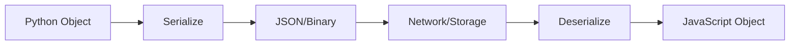
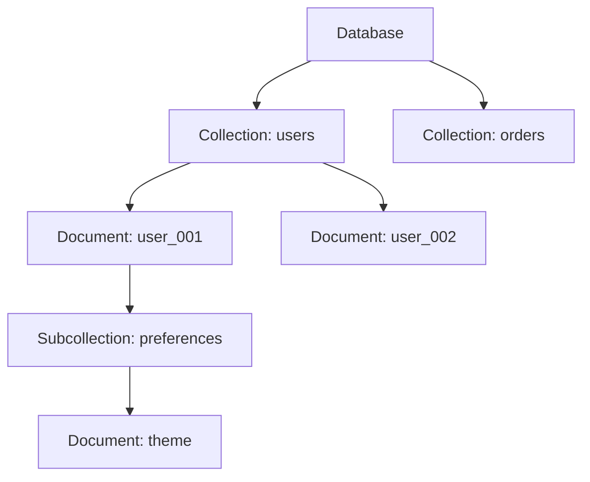
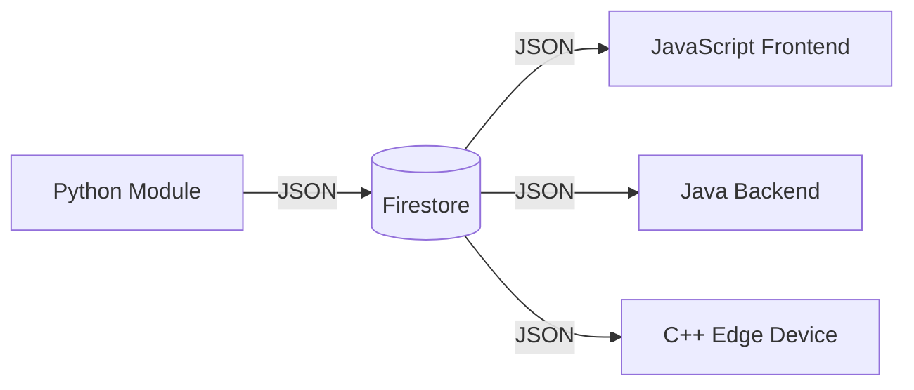
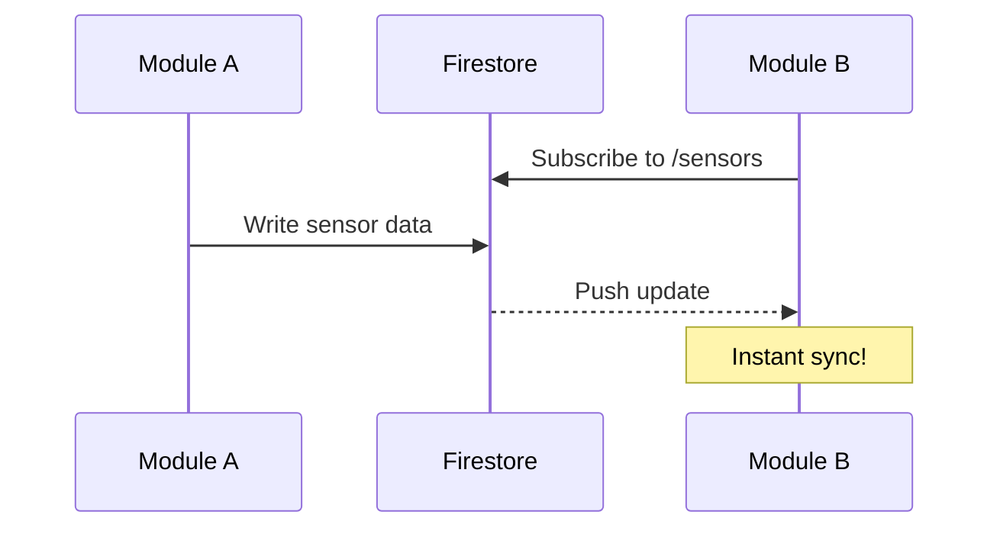

layout: title-slide

@title

# Data Management & Serialization with Firestore
## COMP 7855 - Computer Systems

### Building Scalable Distributed Data Layers

*Managing data across distributed software modules*

---

layout: focus

@main

# Why Data Management Matters in Distributed Systems

In distributed software systems, **data is the glue** that connects independent modules across networks.

## Key Challenges We'll Address

- How do multiple software modules **share state** across a network?
- How do we **serialize** complex data structures for transmission?
- How do we ensure **consistency** when data is distributed?
- How do we **scale** data access as systems grow?

## Today's Focus

We'll explore **Google Firestore** as a practical solution for distributed data management, understanding both the *why* and the *how*.

---

layout: two-column

@main

# The Data Management Problem

## Traditional Approach

```
[Module A] → Local DB
[Module B] → Local DB
[Module C] → Local DB
```

**Problems:**
- Data silos
- Synchronization nightmares
- Inconsistent state
- Complex integration code

@media

## Distributed Approach

```
[Module A] ↘
[Module B] → Cloud DB ← Real-time sync
[Module C] ↗
```

**Benefits:**
- Single source of truth
- Automatic synchronization
- Simplified architecture
- Built-in scalability

---

layout: focus

@main

# Understanding Serialization

**Serialization** is the process of converting data structures into a format that can be stored or transmitted.

## Why Serialization Matters



## Common Serialization Formats

| Format | Use Case | Human Readable |
|--------|----------|----------------|
| JSON | Web APIs, Firestore | Yes |
| Protocol Buffers | High-performance RPC | No |
| XML | Legacy systems | Yes |
| MessagePack | Compact binary | No |

---

layout: left-heavy

@main

# Introduction to Firestore

## What is Firestore?

Google Cloud Firestore is a **NoSQL document database** designed for distributed applications.

### Key Characteristics

- **Document-oriented**: Data stored as documents in collections
- **Real-time sync**: Changes propagate instantly to all clients
- **Offline support**: Works without network connectivity
- **Serverless**: No infrastructure management required
- **Global scale**: Automatic horizontal scaling

### Security

Built-in security rules that run on every read/write operation.

@media

## Data Model

```
users/
  ├── user1
  │   ├── name: "Alice"
  │   └── email: "..."
  └── user2
      └── ...

projects/
  └── proj1
      └── tasks/
          ├── task1
          └── task2
```

---

layout: focus

@main

## Firestore Data Model Deep Dive - Documents and Collections



## Document Structure

- **Documents** contain key-value pairs (fields)
- **Collections** are containers for documents
- **Subcollections** allow hierarchical data organization

---

layout: two-column

@main

# Supported Data Types

## Primitive Types

- `string` - UTF-8 encoded text
- `number` - 64-bit floating point
- `boolean` - true/false
- `null` - Null value
- `timestamp` - Date/time with precision
- `geopoint` - Latitude/longitude
- `bytes` - Binary data (up to 1MB)

## Complex Types

- `array` - Ordered list of values
- `map` - Nested objects
- `reference` - Pointer to another document

@media

## Example Document

```json
{
  "name": "Sensor Module",
  "version": 2.1,
  "active": true,
  "config": {
    "interval": 5000,
    "units": "celsius"
  },
  "readings": [23.4, 24.1, 23.8],
  "lastUpdate": "Timestamp",
  "location": "GeoPoint(45.5, -73.6)"
}
```

---

layout: focus

@main

# Setting Up Firestore in Python

## Installation

```bash
pip install firebase-admin
```

## Initialization

```python
import firebase_admin
from firebase_admin import credentials, firestore

# Initialize with service account
cred = credentials.Certificate('service-account.json')
firebase_admin.initialize_app(cred)

# Get Firestore client
db = firestore.client()
```

**Security Note**: Never commit service account keys to version control. Use environment variables or secret management in production.

---

layout: focus

@main

# CRUD Operations in Firestore

## Create & Update

```python
# Create with auto-generated ID
doc_ref = db.collection('sensors').add({'name': 'TempSensor', 'value': 25.5})

# Create/Update with specific ID
db.collection('sensors').document('sensor_001').set({'name': 'TempSensor', 'value': 25.5})

# Update specific fields (merge)
db.collection('sensors').document('sensor_001').update({'value': 26.0})
```

## Read & Delete

```python
# Read single document
doc = db.collection('sensors').document('sensor_001').get()
if doc.exists:
    print(doc.to_dict())

# Delete document
db.collection('sensors').document('sensor_001').delete()
```

---

layout: left-heavy

@main

# Querying Data

## Query Operators

```python
# Simple equality
sensors = db.collection('sensors')\
    .where('type', '==', 'temperature').get()

# Comparison operators
active = db.collection('sensors')\
    .where('value', '>', 20)\
    .where('value', '<', 30).get()

# Array contains
alerts = db.collection('devices')\
    .where('tags', 'array_contains', 'critical').get()

# Ordering and limiting
recent = db.collection('readings')\
    .order_by('timestamp', direction='DESCENDING')\
    .limit(10).get()
```

@media

## Available Operators

- `==` Equal
- `!=` Not equal
- `<` Less than
- `<=` Less or equal
- `>` Greater than
- `>=` Greater or equal
- `in` In array
- `array_contains`
- `array_contains_any`

**Note**: Compound queries may require composite indexes.

---

layout: focus

@main

# Serialization Patterns for Distributed Modules

## The Challenge: Language Interoperability

When integrating modules written in **different languages**, we need consistent serialization.



## Firestore's Approach

- Documents are stored in an **optimized binary format**
- SDKs handle **automatic serialization/deserialization**
- **Consistent data types** across all supported languages
- Custom object mapping available in each SDK

---

layout: header-two-column

@main

# Activity 1: Data Modeling Exercise

## Scenario: IoT Monitoring System

You're designing a distributed system with:
- **100 sensors** across 10 buildings
- **Real-time readings** every 5 seconds
- **Alerts** when thresholds are exceeded
- **Dashboard** for visualization
- **Mobile app** for notifications

@media
## Your Task (10 minutes)

1. **Design the Firestore data model**
   - What collections do you need?
   - What fields in each document?
   - Any subcollections?

2. **Consider these questions:**
   - How will you query for "all sensors in Building A"?
   - How will you get "last 100 readings for sensor X"?
   - How will you handle alert subscriptions?

**Discuss with your neighbor, then we'll share solutions.**

---

layout: two-column

@main

# Activity 2: Hands-on Firestore Operations

## Setup

1. Access the provided Firestore emulator
2. Open the Python notebook
3. Run the initialization cell

## Tasks (15 minutes)

1. **Create** a collection called `modules` with 3 documents representing software modules

2. **Query** for modules with `status == 'active'`

3. **Update** one module's version number

4. **Add** a subcollection `logs` under one module with 2 log entries

@media

## Document Template

```python
module = {
    'name': 'auth-service',
    'language': 'Python',
    'version': '1.0.0',
    'status': 'active',
    'endpoints': [
        '/login',
        '/logout'
    ],
    'created_at': 
        firestore.SERVER_TIMESTAMP
}
```

## Bonus Challenge

Implement a function to get all endpoints across all active modules.

---

layout: header-two-column

@header
# Activity 3: Cross-Language Integration

@main

## Scenario

You have two modules that need to share data:
- **Python data processor** - writes sensor readings
- **JavaScript dashboard** - reads and displays data

### Your Task (10 minutes)

**Part A: Python Writer**
```python
# Write a reading with consistent schema
def write_reading(sensor_id, value, unit):
    # Your implementation here
    pass
```

**Part B: JavaScript Reader**
```javascript
// Read and process the data
db.collection('readings').onSnapshot((snapshot) => {
    // Your implementation here
});
```
@media
## Discussion Questions

- What **data types** require special handling across languages?
- How do you handle **timestamps** consistently?
- What happens if schemas **diverge** between modules?

---

layout: header-two-column

@header
# Real-Time Listeners and Synchronization

@main

## Real-Time Updates

Firestore enables **push-based** synchronization across all connected clients.

```python
# Set up a real-time listener
def on_snapshot(doc_snapshot, changes, read_time):
    for doc in doc_snapshot:
        print(f'Received: {doc.to_dict()}')

# Watch a collection
watch = db.collection('sensors').on_snapshot(on_snapshot)

# Later, stop listening
watch.unsubscribe()
```

## Use Cases

- Live dashboards
- Collaborative applications
- Real-time notifications
- Distributed state sync

@media



---

layout: focus

@main

# Security Rules for Distributed Systems

## Why Security Rules Matter

In distributed systems, **multiple modules** access the same data. Security rules define **who can do what**.

## Firestore Security Rules Syntax

```javascript
rules_version = '2';
service cloud.firestore {
  match /databases/{database}/documents {
    // Sensors: authenticated modules can read, only admin can write
    match /sensors/{sensorId} {
      allow read: if request.auth != null;
      allow write: if request.auth.token.admin == true;
    }
    
    // Readings: validate data structure
    match /readings/{readingId} {
      allow create: if request.resource.data.keys().hasAll(['value', 'timestamp', 'sensorId'])
                    && request.resource.data.value is number;
    }
  }
}
```

**Key Principle**: Defense in depth — validate on client AND server.

---

layout: header-two-column

@header
# Best Practices & Common Pitfalls
@main


## ✅ Best Practices

- **Denormalize** data for read performance
- Use **batch writes** for atomic operations
- Implement **offline persistence** for resilience
- Design for your **query patterns** first
- Use **server timestamps** for consistency
- Keep documents **small** (< 1MB)
- Create **indexes** for compound queries

@media

## ❌ Common Pitfalls

- **Deep nesting** — harder to query and secure
- **Unbounded arrays** — grow indefinitely
- **Missing indexes** — queries fail silently
- **Ignoring costs** — reads/writes add up
- **No offline handling** — app breaks without network
- **Weak security rules** — data exposed
- **Inconsistent schemas** — integration nightmares

---

layout: focus

@main

# Summary & Key Takeaways

## What We Learned Today

1. **Data management** is critical for distributed software systems — modules need a shared, consistent data layer

2. **Serialization** enables data exchange between modules written in different languages

3. **Firestore** provides a scalable, real-time NoSQL database suitable for distributed applications:
   - Document-collection model
   - Automatic synchronization
   - Cross-platform SDKs
   - Built-in security

4. **Security rules** are essential for protecting distributed data access

## Next Steps

Lab assignment: Implement a distributed monitoring system using Firestore