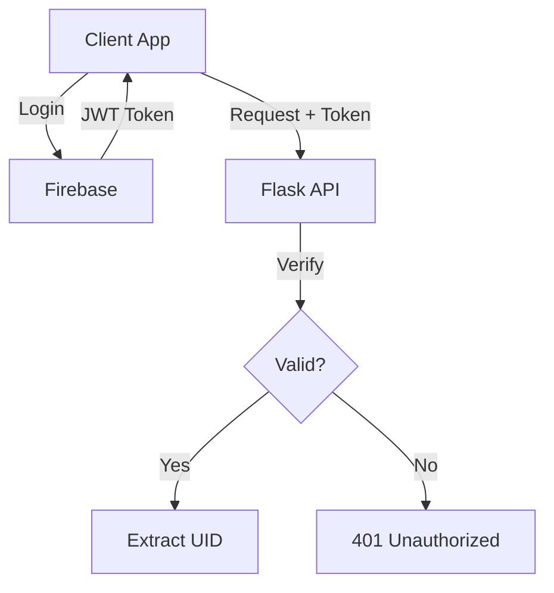
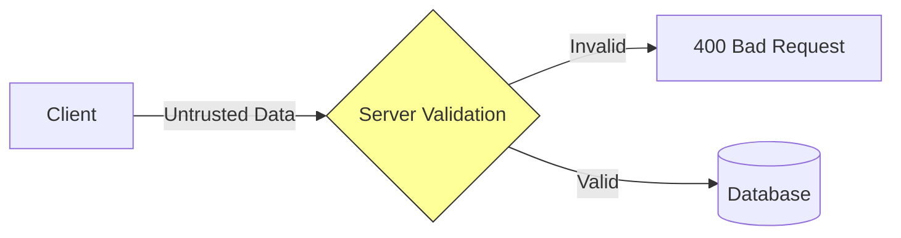
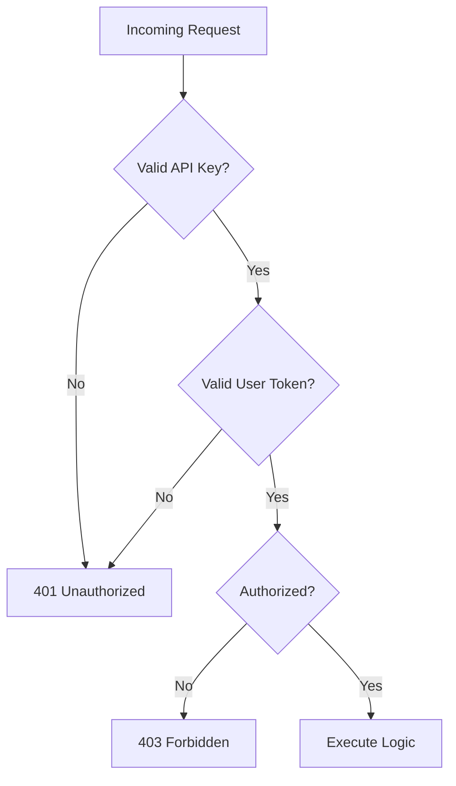
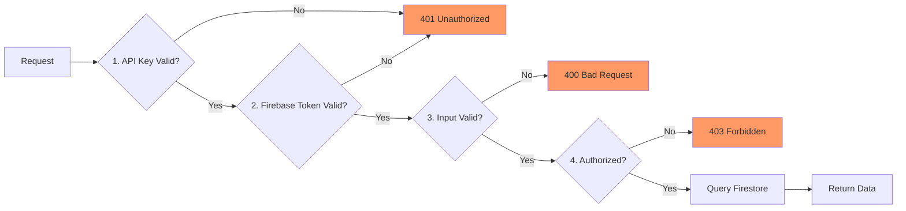

layout: title-slide

@title

# Building Secure APIs
## COMP7855 - Week 7
### Instructor: [Name]

---

layout: header-content

@header

## Today's Roadmap

@main

### The Four Pillars of Secure Design
1.  **Auth:** Proving identity (Who are you?)
2.  **Validation:** Ensuring data integrity (Is this safe?)
3.  **Queries:** Efficient data retrieval (How do we find it?)
4.  **Protection:** Access control layers (Are you allowed?)

> **Core Concept:** Security is defense in depth—multiple layers that must all pass.

---

layout: header-two-column

@header

## Firebase Auth: Identity Provider

@main

### What It Does
Firebase Auth acts as a trusted **Identity Provider (IdP)**. It handles the complex cryptography of login so you don't have to.

### Separation of Concerns
- **Firebase Auth:** Manages credentials, sessions, and tokens.
- **Your Database:** Stores application data (profiles, preferences).
- **Your API:** Enforces business logic and authorization.

> **Rule:** Never trust client claims. Always verify the cryptographic signature server-side.

@media



---

layout: header-two-column

@header

## Server-Side Verification

@main

### The Trust Boundary
The moment a request reaches your server, you enter the "Trust Zone." You must verify the token *before* any database operation.

### Verification Flow
1.  **Extract** the token from the `Authorization` header.
2.  **Verify** signature and expiry using Firebase Admin SDK.
3.  **Extract** the `uid` → This is your single source of truth for identity.

> **Why:** If the token is invalid, reject immediately. Do not waste resources querying the database.

@media

```python
def get_verified_uid(auth_header):
    token = extract_bearer_token(auth_header)
    
    # Cryptographic verification happens here
    decoded = auth.verify_id_token(token) 
    
    return decoded['uid']  # The trusted identity
```

---

layout: header-two-column

@header

## Data Modeling: Identity vs. Profile

@main

### Why Separate Collections?
Firebase Auth stores *credentials* (email, password hash). Firestore stores *application state* (role, settings).

### The Link Pattern
Use the Auth `uid` as the Firestore Document ID.
- **Benefit 1:** Instant lookups (O(1) complexity).
- **Benefit 2:** Guaranteed uniqueness.
- **Benefit 3:** Natural alignment with security rules.

@media

```text
Firestore Structure:
users/
  {uid}/  <-- Document ID matches Auth UID
    ├─ email: "user@example.com"
    ├─ role: "admin"
    └─ preferences: {...}
```

---

layout: header-two-column

@header

## Pattern: Lazy Initialization

@main

### The Challenge
A user exists in Auth immediately after signup, but their profile document may not exist in Firestore yet.

### The "Get or Create" Pattern
1.  Verify Token → Get `uid`.
2.  Check if `users/{uid}` exists.
3.  **If missing:** Initialize document with defaults (role, timestamps).
4.  **If exists:** Return existing data.

> **Concept:** Decouple *identity creation* (Auth) from *profile initialization* (Firestore).

@media

```python
def ensure_profile(uid, email):
    doc_ref = db.collection('users').document(uid)
    doc = doc_ref.get()
    
    if not doc.exists:
        # Lazy initialization on first access
        doc_ref.set({
            'uid': uid,
            'email': email,
            'role': 'user',
            'created_at': SERVER_TIMESTAMP
        })
        return doc_ref.get().to_dict()
    return doc.to_dict()
```

---

layout: header-two-column

@header

## Activity: Protected Profile Endpoint

@main

### Objective
Implement `GET /api/profile` demonstrating the **Auth → Firestore** link.

### Requirements
1.  **Verify:** Reject requests without valid Firebase ID token (401).
2.  **Resolve:** Extract `uid` from verified token.
3.  **Fetch/Create:** Return `users/{uid}`, creating if first visit.

### Success Criteria
- Invalid token → `401 Unauthorized`
- First request → `200 OK` (new doc created)
- Subsequent → `200 OK` (existing doc)

@media

```python
@app.route("/api/profile", methods=["GET"])
def profile():
    # 1. Verify Trust
    uid = get_verified_uid(request.headers.get("Authorization"))
    if not uid: 
        return jsonify({"error": "Unauthorized"}), 401
    
    # 2. Resolve Data
    user_data = ensure_profile(uid, "email_from_token")
    
    # 3. Return
    return jsonify(user_data), 200
```

---

layout: header-two-column

@header

## Validation: The Integrity Gate

@main

### Why Server-Side Validation?
- **Client-side:** UX only (immediate feedback). Can be bypassed.
- **Server-side:** Security requirement. Enforces data integrity.

### The Trust Boundary Principle
> **Never trust data crossing the network boundary.**

### Defense Layers
1.  **Client:** Format hints, required fields.
2.  **Server:** Strict type checking, bounds, allowed values.
3.  **Database:** Schema constraints, Security Rules.

@media



---

layout: header-two-column

@header

## Validation Patterns

@main

### 1. Fail Fast
Check critical errors (missing auth, malformed JSON) immediately. Stop processing if found.

### 2. Collect All Errors
Don't return on the first validation error. Check *all* fields and return a comprehensive error list. Reduces round-trips.

### 3. Whitelist Fields
Only process fields you explicitly expect. Ignore or reject unknown fields to prevent "mass assignment" vulnerabilities.

@media

```python
def validate_user_update(data):
    errors = []
    allowed = {"display_name", "role"}
    
    # 1. Check for unknown fields
    if unknown := set(data.keys()) - allowed:
        errors.append(f"Unknown fields: {unknown}")

    # 2. Validate specific fields
    if "role" in data and data["role"] not in ["user", "admin"]:
        errors.append("Invalid role")
        
    # 3. Return all errors at once
    return errors
```

---

layout: header-two-column

@header

## Activity: Robust Input Validation

@main

### Task
Refactor `PUT /api/users/<uid>` to enforce strict validation.

### Requirements
1.  **Whitelist:** Reject fields other than `display_name`, `email`, `role`.
2.  **Type & Bounds:** 
    - `display_name`: string, 1-100 chars.
    - `role`: must be in `['user', 'admin']`.
3.  **Aggregate Errors:** Return `400 Bad Request` with JSON list of *all* failures.

@media

```python
@app.route("/api/users/<uid>", methods=["PUT"])
def update_user(uid):
    data = request.get_json() or {}
    
    # TODO: Validate against whitelist
    # TODO: Check types and bounds
    # TODO: Collect ALL errors
    # if errors: return jsonify({"errors": errors}), 400
    
    # TODO: Apply update
    return jsonify({"status": "updated"}), 200
```

---

layout: header-two-column

@header

## Firestore Querying: Model for Access

@main

### The NoSQL Mindset
In SQL, you model for relationships. In Firestore, you **model for queries**.

### Key Constraints
- **No Joins:** Denormalize data if you need to query across collections.
- **Shallow Queries:** Query one collection at a time.
- **Indexes:** Every `where` + `order_by` combination needs a composite index.

> **Principle:** Define your queries *first*, then design data structure to support them.

@media

```text
❌ Anti-pattern: 
  Query users where "orders.status" == "shipped" 
  (Requires joining users & orders)

✅ Pattern: 
  Denormalize: Store "last_shipped_order_id" on user doc
  OR
  Query the "orders" collection directly.
```

---

layout: header-two-column

@header

## Query Limits & Index Strategy

@main

### Hard Limits
| Feature | Limit | Design Implication |
| :--- | :--- | :--- |
| `in` / `array-contains-any` | 10 items | Batch large queries |
| Range filters (`>`, `<`) | 1 field/query | Can't filter `price > 10` AND `date < 2023` |
| OR queries | 10 filters | Complex logic may need client-side merge |

### Composite Indexes
If you filter on `A` and sort by `B`, Firestore needs index `(A, B)`.
- **Dev:** Firestore provides link to create index.
- **Prod:** Define indexes in `firestore.indexes.json` as code.

@media

```python
# Requires composite index on (status, created_at)
query = (db.collection("orders")
    .where("status", "==", "pending")
    .order_by("created_at", direction=DESCENDING)
    .limit(10))
```

---

layout: header-two-column

@header

## Activity: Dynamic Search Endpoint

@main

### Goal
Build `GET /api/products` with optional filtering.

### Requirements
1.  Accept params: `category`, `min_price`, `max_price`, `sort`.
2.  **Conditionally** build query chain based on provided params.
3.  Handle range constraint: `min_price` and `max_price` on same field is allowed.
4.  Return 400 if filter combination requires missing index.

@media

```python
@app.route("/api/products", methods=["GET"])
def search_products():
    query = db.collection("products")
    
    # Apply filters only if params exist
    if category := request.args.get("category"):
        query = query.where("category", "==", category)
    
    if min_price := request.args.get("min_price"):
        query = query.where("price", ">=", float(min_price))
    
    # Execute and return
    results = query.get()
    return jsonify([doc.to_dict() for doc in results]), 200
```

---

layout: header-two-column

@header

## API Security: Defense in Depth

@main

### The Protection Layers
1.  **Transport:** HTTPS (TLS) - Encryption in transit.
2.  **Identity:** API Keys - Identifies the *client application*.
3.  **Authentication:** Firebase Tokens - Identifies the *end user*.
4.  **Authorization:** Business Logic - Determines *permissions*.
5.  **Rate Limiting:** Prevents abuse and cost spikes.

> **Distinction:** API Keys = "Which app is calling?" | Auth Tokens = "Which user is logged in?"

@media



---

layout: header-two-column

@header

## API Keys: Client Identity

@main

### Purpose
API keys identify the *project* or *application*, not the user. They enable:
- Usage tracking by client app.
- Revocation of compromised clients.
- Quotas and rate limits per app.

### Implementation
- Send via Header: `X-API-Key` (Never in URL/query params).
- Check early in request lifecycle (Middleware/Decorator).
- Store secrets in Environment Variables.

@media

```python
import os
from functools import wraps

API_KEY = os.environ.get("MY_API_KEY")

def require_api_key(f):
    @wraps(f)
    def decorated(*args, **kwargs):
        key = request.headers.get("X-API-Key")
        if key != API_KEY:
            return jsonify({"error": "Invalid API Key"}), 401
        return f(*args, **kwargs)
    return decorated
```

---

layout: left-heavy

@header
## Secret Management Principles

@main

| Do | Don't |
| :--- | :--- |
| Use Environment Variables | Hardcode in source files |
| Use Secret Managers (GCP/AWS) | Commit `.env` to Git |
| Rotate keys periodically | Use same key for Dev/Prod |
| Scope keys (Read-only vs Admin) | Give all keys full access |

@media

### Advanced Concepts
- **Key Rotation:** Support multiple valid keys during transition periods.
- **Audit Logs:** Log which API key ID was used (never the secret).
- **Expiration:** Use short-lived keys for higher security scenarios.

---

layout: header-two-column

@header

## Activity: Layered API Security

@main

### Task
Secure API with two distinct key layers.

### Requirements
1.  **Global Protection:** Apply `@require_api_key` to all routes.
2.  **Admin Protection:** Create separate `ADMIN_API_KEY`.
   - Routes under `/api/admin/*` require *Admin* key.
   - Regular keys get `403 Forbidden` on admin routes.
3.  **Logging:** (Bonus) Log API key ID with every request for auditing.

@media

```python
# Test Scenarios:
# 1. Request without key → 401
# 2. Valid regular key → 200 (public route)
# 3. Regular key on /api/admin → 403
# 4. Admin key on /api/admin → 200
```

---

layout: header-content

@header

## The Secure Request Lifecycle

@main

### Integrated Pipeline
A secure request flows through specific checkpoints. Failure at any layer rejects the request *before* expensive operations occur.



### Key Takeaway
**Fail Fast.** Reject invalid requests at the earliest possible layer to minimize attack surface and resource waste.

---

layout: header-two-column

@header

## Key Takeaways

@main

### Architectural Principles
- **Identity:** Firebase Auth handles *who*, Firestore handles *what*. Link via `uid`.
- **Integrity:** Server-side validation is non-negotiable. Whitelist fields, fail fast.
- **Performance:** Model Firestore data for specific queries. Respect index limits.
- **Security:** Layer defenses: API Key → Auth Token → Validation → Authorization.

### Next Steps
- Implement Rate Limiting (Redis/Firebase Extensions).
- Explore Firestore Security Rules for client-direct access.
- Add structured logging for security auditing.

@media

> "Security is a process, not a product." – Bruce Schneier
