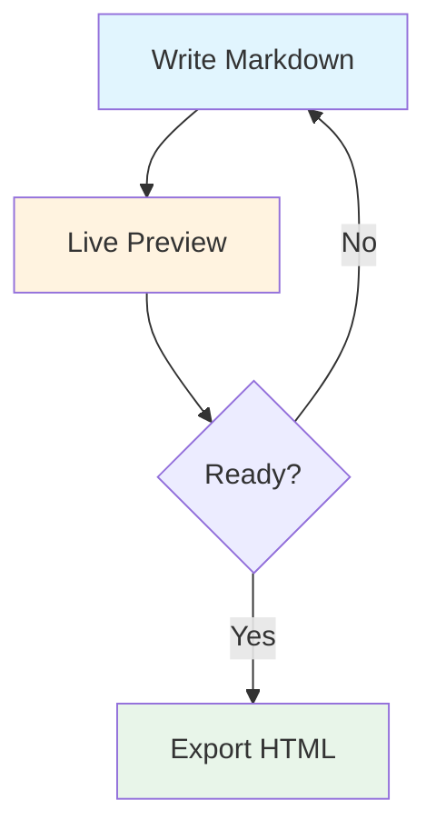

layout: title-slide

@title

# Parity Fixture

### Export/render parity harness deck

### One slide per renderer feature.

---

layout: two-column

<!-- notes: Verify this speaker note reaches the presenter view but never the stage. -->

@header

# Rich Text

@main

### Lists and inline styles

1. **Bold lead** with trailing text
2. _Italic_ and `inline code`
3. A [link to SlideMD](https://github.com/hesamat/slidemd)

> A blockquote that must survive both parsers unchanged.

@media

### Ordered details

- Nested content
  - Indented sub-item
- Terminal item

---

layout: "header media" "main media" "footer media" / 2fr 1fr

@header

# Custom Grid

@main

| Column A | Column B |
| -------- | -------- |
| alpha    | 1        |
| beta     | 2        |
| gamma    | 3        |

@media

Full-height media area spanning every row.

@footer

Fixture deck for [export/render parity](https://github.com/hesamat/slidemd).

---

layout: header-content

@header

# Code Highlighting

@main

```python
def fibonacci(n: int) -> int:
    if n <= 1:
        return n
    return fibonacci(n - 1) + fibonacci(n - 2)
```

```js { center }
const parity = (dev, dist) => dev.length === dist.length;
```

---

layout: header-content

@header

# Math Notation

@main

Inline: $E = mc^2$ and $\alpha \beta$.

Block:

$$\int_{-\infty}^{\infty} e^{-x^2} dx = \sqrt{\pi}$$

---

layout: header-content

@header

# Mermaid Diagram

@main



---

layout: two-column

@header

# Text Blocks

@main

### Multi-column

::: text-block { column-count=2 }

1. First item
2. Second item
3. Third item
4. Fourth item

:::

### Styled block

::: text-block { color="#1a95b8" markdown=true }

**Bold text** and _italic_ inside a styled block.

:::

@media

### Speech bubble

::: text-block { id="tb-1" preset="bubble" tail=top }

Anyone can write on slides!

:::

---

layout: left-heavy

@header

# Table Directives

@main

### Styled

::: table { fontSize=20 headerColor="#1a95b8" striped=false }

| Feature           | Support  |
| ----------------- | -------- |
| Code highlighting | Prism.js |
| Math rendering    | KaTeX    |

:::

@media

### Borderless + custom columns

::: table { borders=false align=left columns=2,4,8 }

| A   | B   | C   |
| --- | --- | --- |
| 1   | 2   | 3   |
| 4   | 5   | 6   |

:::

---

layout: media-span-right

@header

# Embedded Image

@main

A data-URI image so the fixture needs no sidecar files.

### Positioning attributes

The `style` attribute must survive both parsers identically.

@media


---

theme: dark
background: linear-gradient(135deg, #0f172a 0%, #1e293b 100%)

layout: two-column

@header

# Dark Theme Slide

@main

Dark theme with a gradient background.

- Contrast check
- Second bullet

@media

Dark media area content.

---

layout: header-content
hidden: true

@main

This hidden slide is still in the DOM and must match byte-for-byte.
